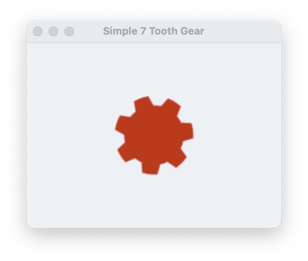
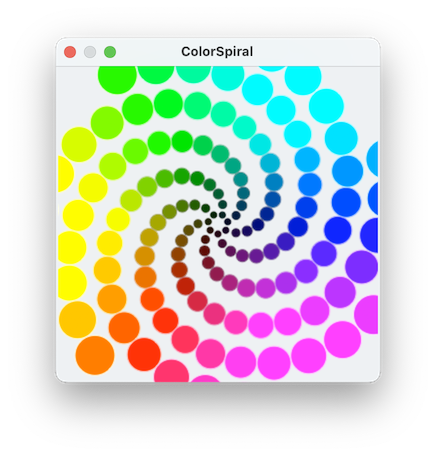
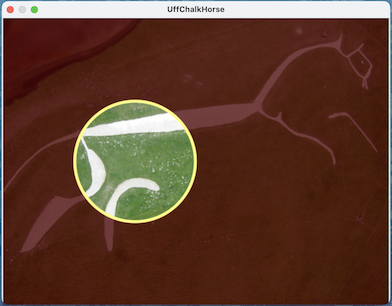
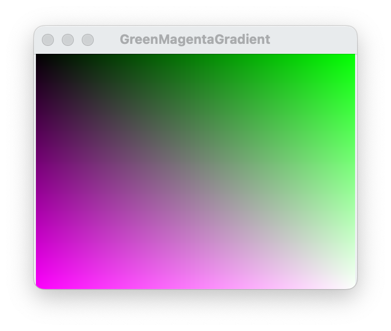

#### previous topic: [Scripting In Depth D: Communicating with Other Apps](ScriptingOtherApps.md)

## A Catalog of all the example pages

[A Gear Shape](GearShapeExample.md)   

[Color Spirals](ColorSpiralsExample.md)   

 
[Punch Though a Layer](BlendCopyPunchThrough.md)   

[Pixel Gradient](PixelGradientExample.md)   

#### next topic: 
