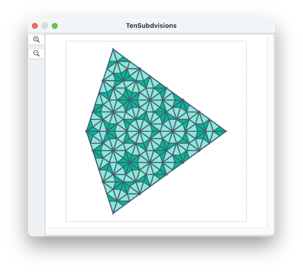
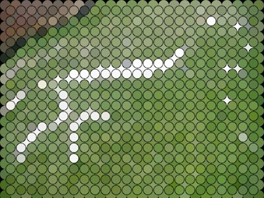

####  [Table of Contents](TableOfContents.md)   
#### previous topic: [Scripting In Depth D: Communicating with Other Apps](ScriptingOtherApps.md)

## A Catalog of many of the examples and where to find them  

Click on the images to go to the page with the example:

   
 
   

   

   

   

   

   

   

   

   

####  [Table of Contents](TableOfContents.md)   