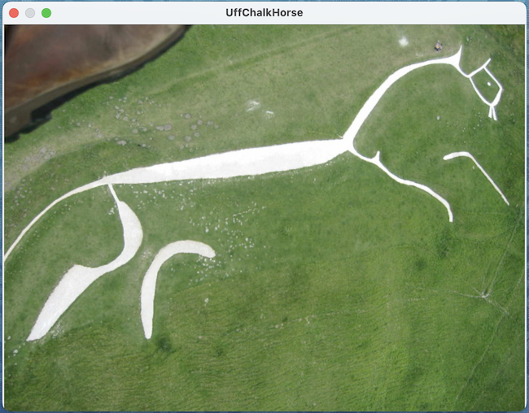
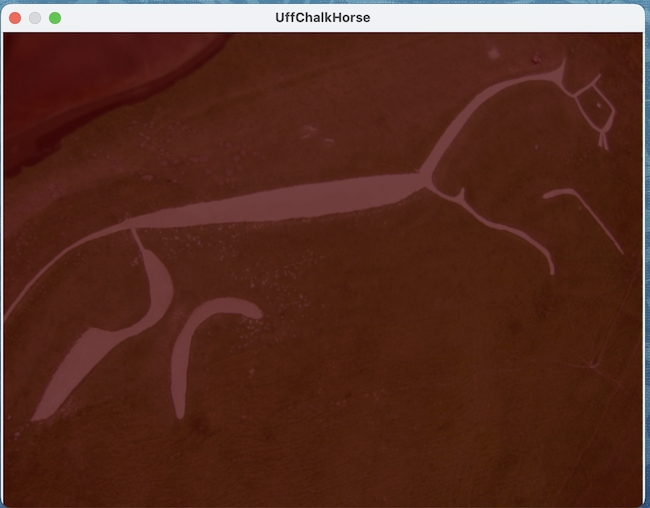
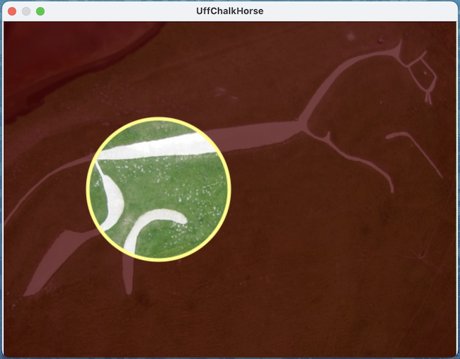

#### Containing topic: [Shapes](SinterpixelsShapes.md) 

## Using blendCopy to punch through a layer

Here's an example of how to create a layer with a "hole" in it to see through to the layer below.  Lets start out by opening a file, in this case an aeriel view of the [Uffington Chalk Horse](https://commons.wikimedia.org/wiki/File:Aerial_view_from_Paramotor_of_Uffington_White_Horse_-_geograph.org.uk_-_305467.jpg), a Creative Commons image by Dave Price



Now, this script creates a red tinted layer on top of the base canvas:
By default, the new layer is created with the same size as the base canvas.

```
tell application "SinterPixels"
	tell document 1
		set aLayer to make new layer 
		set red component of every pixel of aLayer to 0.2
		set alpha component of every pixel of aLayer to 0.75
	end tell
end tell
```



At this point, we have one overlayer on top of the main canvas.  Now, we will punch a hole in the red tint layer by creating a yellow circle with transparent fill using a **blendCopy** blend mode. :

```
tell application "SinterPixels"
	tell layer 1 of document 1
		make new circle with properties {radius:100, line width:5, position:{-100, 0}, fill color:clear, color:{0.5, 1.0, 1.0, 1.0}, blend mode:blendCopy}
	end tell
end tell
```




#### Containing topic: [Shapes](SinterpixelsShapes.md) 
