####  [Table of Contents](TableOfContents.md) 
#### previous topic: [Specifying Colors](Colors1.md)  next topic: [Pixels Part 1](SinterpixelsPixels.md)

## Colors Part 2: Blend Mode

One more property that all shapes have is **blend mode**, The blend mode determines how a shape is composited on top of its background.  The default blend mode is "paintOver".  The blend mode must be one of the following:

- **paintOver** : Paints the source image samples over the background image samples.  This is CGBlendMode.normal, and is the default
- **multiply** : Multiplies the source image samples with the background image samples. This results in colors that are at least as dark as either of the two contributing sample colors.
- **screen** : Multiplies the inverse of the source image samples with the inverse of the background image samples, resulting in colors that are at least as light as either of the two contributing sample colors.
- **overlay** : CGBlendMode.overlay
- **darken** : CGBlendMode.darken
- **lighten** : CGBlendMode.lighten
- **colorDodge** : Brightens the background image samples to reflect the source image samples.
- **colorBurn** : Darkens the background image samples to reflect the source image samples.
- **softLight** : CGBlendMode.softLight
- **hardLight** : CGBlendMode.hardLight
- **difference** : CGBlendMode.difference
- **exclusion** : similar to difference, but with lower contrast.
- **hue** : Uses the luminance and saturation values of the background with the hue of the source image.
- **saturation** : Uses the luminance and hue values of the background with the saturation of the source image.
- **sourceColor** : Uses the luminance values of the background with the hue and saturation values of the source image.
- **luminosity** : Uses the hue and saturation of the background with the luminance of the source image.
- **blendClear** : erases the destination
- **blendCopy** : replaces destination with source - CGBlendMode.copy
- **sourceIn** : result is source * destination alpha, i.e. R = S*Da
- **sourceOut** : R = S*(1 - Da)
- **sourceAtop** : R = S*Da + D*(1 - Sa)
- **destinationOver** : R = S*(1 - Da) + D
- **destinationOut** : R = D*(1 - Sa)
- **destinationIn** : R = D*Sa
- **destinationAtop** : R = S*(1 - Da) + D*Sa
- **xor** : R = S*(1 - Da) + D*(1 - Sa)
- **plusDarker** : R = MAX(0, 1 - ((1 - D) + (1 - S)))
- **plusLighter** : R = MIN(1, S + D)

Shown below are the results of drawing circles with different blend modes.  The background is stripes of different colors, from top to bottom the colors are black, red, green, blue, white, black, dark gray, gray, light gray, white, black, cyan, magenta, yellow, white.

The colors of the circles, from left to right: black, red, green, blue, cyan, magenta, yellow, white

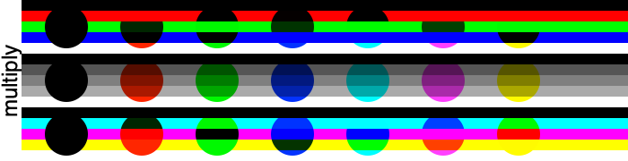
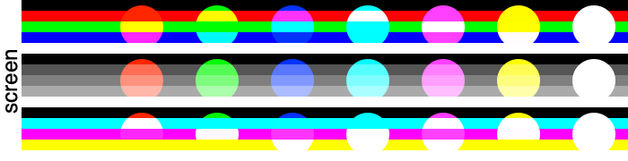
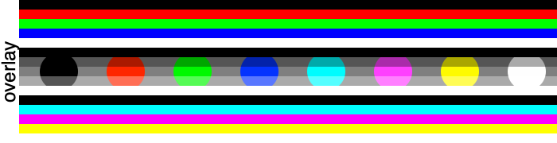
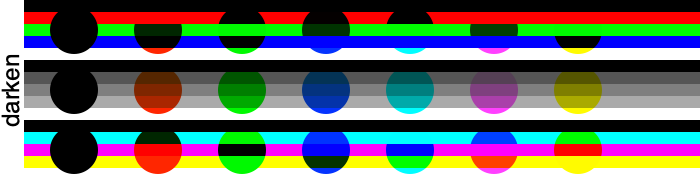
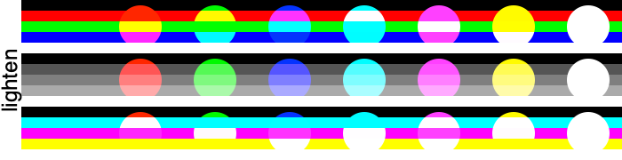
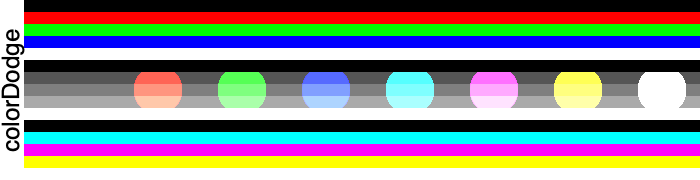
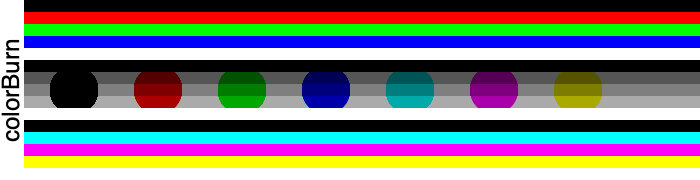
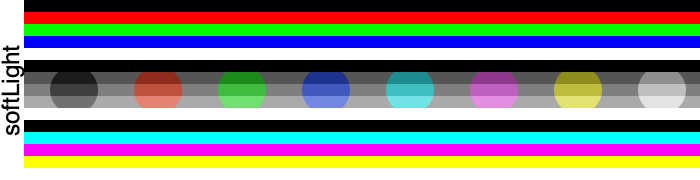
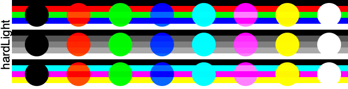
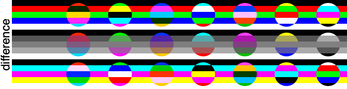
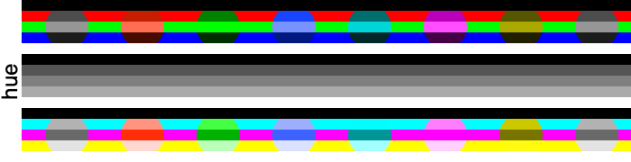
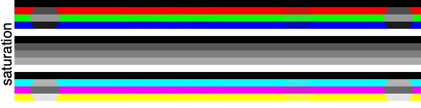
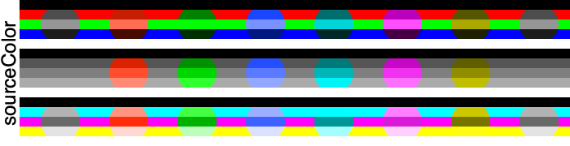
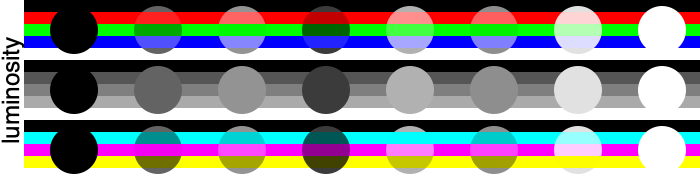
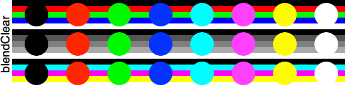

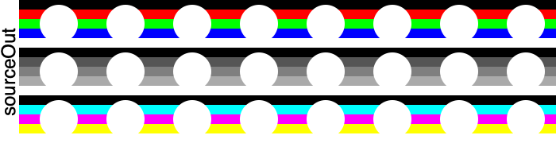
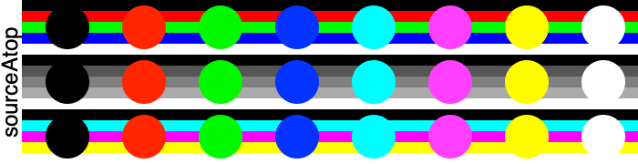

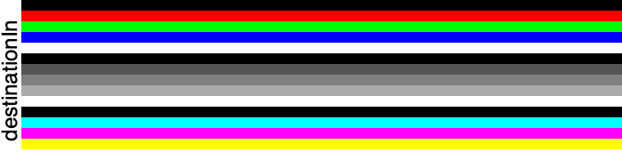

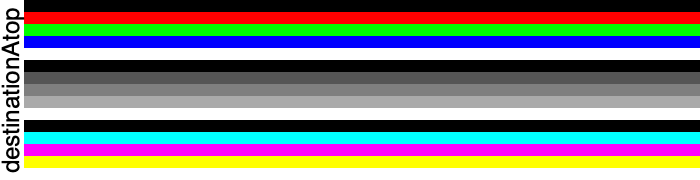
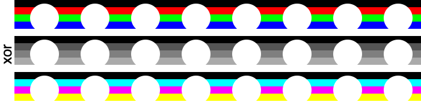
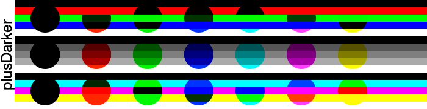
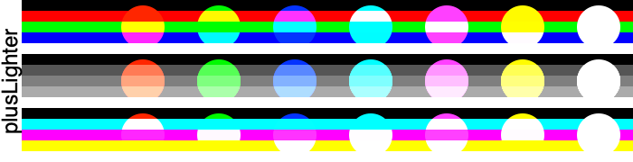 

Some of these blend modes don't look very interesting here, but they are much more interesting when the circles or the backgrounds have alpha values of less than one.  See [More Blend Modes](MoreBlendModes.md) for an exhaustive set of images.

A particularly interesting blend mode is **blendCopy** when used with a shape with a clear fill color.  This can be used to create transparent regions in an image or in a layer.
 
See the [Punch Though a Layer Example](BlendCopyPunchThrough.md) for a trick on using a blend mode to get a different effect when drawing a circle.
 

#### previous topic: [Specifying Colors](Colors1.md)  next topic: [Pixels Part 1](SinterpixelsPixels.md)
