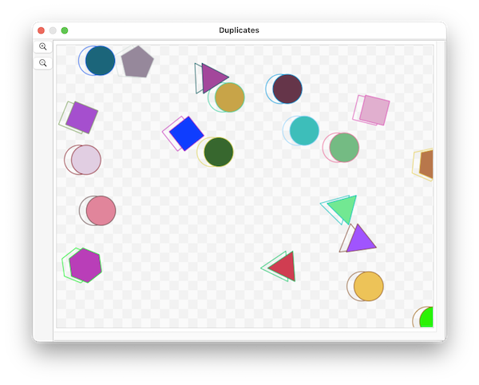

####  [Table of Contents](TableOfContents.md) 
#### previous topic: [Exporting Movies](Movies.md)   [Making a Mirror Image](ReflectVerb.md)

## Making a Copy of a Shape

SinterPixels shapes understand the **duplicate** action. Any shape can be duplicated.  Here's a script which creates some polygons and circles, then duplicates each one, moving the duplicate a small bit, and then sets the fill color of the original to clear, making an interesting effect:
 


```
tell application "SinterPixels"
	tell document 1
		repeat 10 times
			make new polygon with properties {radius:30}
			make new circle with properties {radius:25}
		end repeat
		
		repeat with s in (get every shape)
			set dupe to duplicate s
			set oldX to x coordinate of s
			set x coordinate of dupe to oldX + 12
			set fill color of s to clear
		end repeat
	end tell
end tell
```

#### previous topic: [Exporting Movies](Movies.md)   [Making a Mirror Image](ReflectVerb.md)
