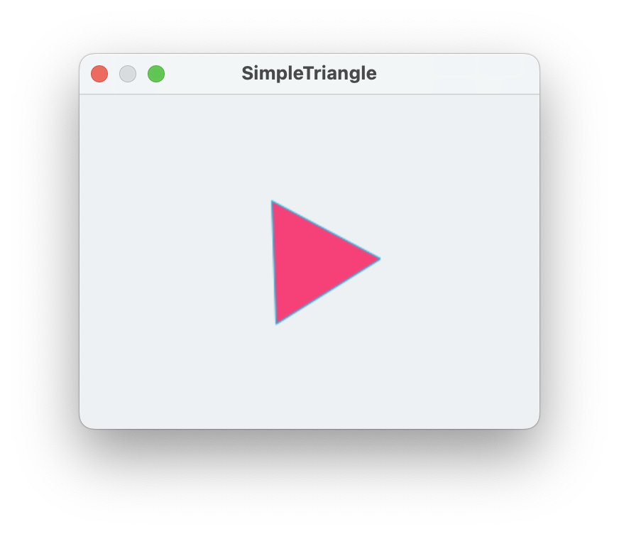
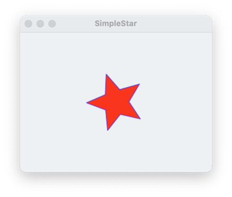
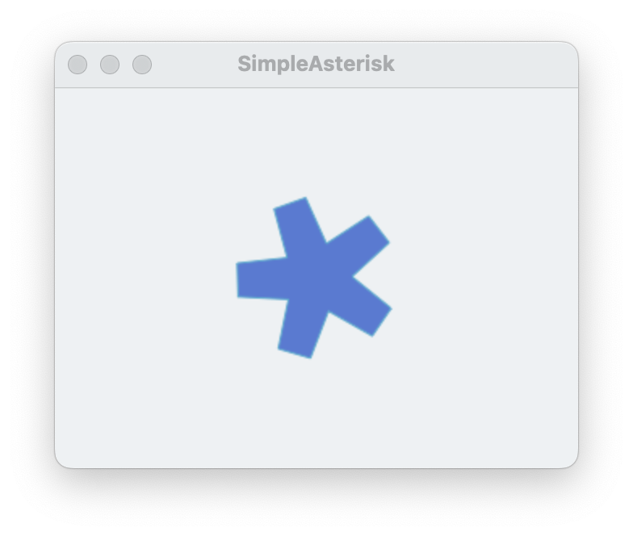

#### Containing topic: [Shapes](SinterpixelsShapes.md) 

## Animating Gears

Here's an example of how to make a polygon in the shape of a gear. A gear is just a polygon, where the outer edge is roughly a circle, but with notches for each tooth.

A polygon can be defined by a sequence of radii, so for example, the sequence {50, 50, 50} just creates a triangle, three points each with a radius from the center of 50:

```
tell application "SinterPixels"
	tell document 1
		make new polygon with properties {radii:{50, 50, 50}, position:{0, 0}}
	end tell
end tell
```



Let's alternate the radii larger and smaller to make a star.  In this case, 5 repetitions of 50 and 22 to make a five-pointed star:

```
tell application "SinterPixels"
	tell document 1
		make new polygon with properties {radii:{50, 22, 50, 22, 50, 22, 50, 22, 50, 22}, position:{0, 0}}
	end tell
end tell
```



Now make the points of the star into teeth by repeating the higher number.  This creates a simple asterisk shape:

```
tell application "SinterPixels"
	tell document 1
		make new polygon with properties {radii:{50, 50, 22, 50, 50, 22, 50, 50, 22, 50, 50, 22, 50, 50, 22}, position:{0, 0}}
	end tell
end tell
```



So, most of the work of making a gear is making a list of the radii.  In that list, we'll have a repeating sequence of higher and lower numbers, one repetition for each tooth.  We'll want to specify the radius of the gear, and also the amount which each tooth sticks out.  Here's a script which produces such a list:

```
to gearRadii(numberOfTeeth, rad, depth)
	set gList to {}
	repeat with s from 1 to numberOfTeeth
		set gList to gList & rad
		set gList to gList & rad
		set gList to gList & (rad - depth)
		set gList to gList & (rad - depth)
		set gList to gList & (rad - depth)
		set gList to gList & rad
		set gList to gList & rad
	end repeat
	return gList
end gearRadii

-- make a list of radii for a gear with 7 teeth, radius of 50, notch depth of 12
gearRadii(7, 50, 12)
```

The result of this function is 

```
{50, 50, 38, 38, 38, 50, 50, 50, 50, 38, 38, 38, 50, 50, 50, 50, 38, 38, 38, 50, 50, 50, 50, 38, 38, 38, 50, 50, 50, 50, 38, 38, 38, 50, 50, 50, 50, 38, 38, 38, 50, 50, 50, 50, 38, 38, 38, 50, 50}
```

Now, making a gear is a bit easier:


```
set getRadiiList to gearRadii(7, 50, 12)
tell application "SinterPixels"
	tell document 1
		make new polygon with properties {radii:getRadiiList, position:{0, 0}}
	end tell
end tell
```


#### Containing topic: [Shapes](SinterpixelsShapes.md) 

