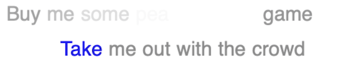

####  [Table of Contents](TableOfContents.md) 
#### Containing topic: [All Examples](AllExamples.md) 

##   Karaoke Lyrics

  

This a fairly involved example on how to generate a video with lyrics to a song as you would want for singing Karaoke. In this case, it uses the Ability to position a text shape in a document, set its color (including alpha), and record a movie.  So, very little of this script is calls to SinterPixels.  Rather, most of it is organizing the data -- the song lyrics and the SinterPixels objects that correspond to the lyrics -- so that a karaoke-ish video is generated.

See the complete movie [here](../images/TMOTTBGKaraoke.mov)

The input data for such a video are the individual words, of course, but also how much time each word should highlighted in the video, so as to capture the rhythm of the song.

In this script, we supply the input data in the following form:  Each line of the song looks like this:

```
{{"Take", "me", "out", "to", "the", "ball", "game"}, {2, 1, 1, 1, 1, 3, 3}}
```

This is just a list of the words, followed by a list of the note length for each word. Here, 1 is a quarter note, 2 is a half note, etc.

The whole data for one verse is a list of 8 of these lines:

```
set allLines to { ¬
  {{"Take", "me", "out", "to", "the", "ball", "game"}, ¬
          {2, 1, 1, 1, 1, 3, 3}}, ¬
  {{"Take", "me", "out", "with", "the", "crowd"}, ¬
           {2, 1, 1, 1, 1, 6}}, ¬
  {{"Buy", "me", "some", "pea", ".nuts", "and", "crack", ".er", "jack"}, ¬
           {1, 1, 1, 1, 1, 1, 2, 1, 3}}, ¬
  {{"I", "don't", "care", "if", "I", "ev", ".er", "get", "back"}, ¬
           {2, 1, 1, 1, 1, 1, 1, 1, 1}}, ¬
  {{"'cause", "it's", "root", "root", "root", "for", "the", "Phil", ".lies"}, ¬
           {1, 1, 2, 1, 1, 1, 1, 3, 2}}, ¬
  {{"If", "they", "don't", "win", "it's", "a", "shame"}, ¬
           {1, 2, 1, 1, 1, 1, 4}}, ¬
  {{"For", "it's", "1", "2", "3", "strikes", "you're", "out"}, ¬
           {1, 1, 3, 3, 1, 1, 1, 1}}, ¬
  {{"at", "the", "old", "ball", "game"}, ¬
           {1, 1, 3, 3, 6}}}
```

There are a few words that are broken up so that different parts of the word can be emphasized separately -- "peanuts", "ever" and "Phillies" (Sorry, Mets fans, "Metsies" just doesn't sound right.)  In these cases, they are entered as separate words, each with a corresponding note length in the second list.  However, we don't want to actually put a space between these words, so the second half of these words are marked with a "." in the beginning of the word -- the script looks for those and knows both that the period should be stripped before making the text shape, and it knows not to put in word spacing.

The script uses the alpha component of the fill color of the text to fade the shapes in and out.

Note that "Take Me Out To the Ball Game" is in 3/4 time, and if each line corresponded to four bars, the numbers in each line should add up to 12.  This is true for the first three lines, but because the fifth, sixth, seventh and eight lines all start early the pattern is broken.

Here's the complete script:
```
set allLines to {{{"Take", "me", "out", "to", "the", "ball", "game"}, {2, 1, 1, 1, 1, 3, 3}}, ¬
	{{"Take", "me", "out", "with", "the", "crowd"}, {2, 1, 1, 1, 1, 6}}, ¬
	{{"Buy", "me", "some", "pea", ".nuts", "and", "crack", ".er", "jack"}, {1, 1, 1, 1, 1, 1, 2, 1, 3}}, ¬
	{{"I", "don't", "care", "if", "I", "ev", ".er", "get", "back"}, {2, 1, 1, 1, 1, 1, 1, 1, 1}}, ¬
	{{"'cause", "it's", "root", "root", "root", "for", "the", "Phil", ".lies"}, {1, 1, 2, 1, 1, 1, 1, 3, 2}}, ¬
	{{"If", "they", "don't", "win", "it's", "a", "shame"}, {1, 2, 1, 1, 1, 1, 4}}, ¬
	{{"For", "it's", "1", "2", "3", "strikes", "you're", "out"}, {1, 1, 3, 3, 1, 1, 1, 1}}, ¬
	{{"at", "the", "old", "ball", "game"}, {1, 1, 3, 3, 6}}}

set lineCount to count allLines

to durationOfLine(karaokeLine)
	set ticks to item 2 of karaokeLine
	set lineDuration to 0
	repeat with t in ticks
		set lineDuration to lineDuration + t
	end repeat
	return lineDuration
end durationOfLine

to removeFirstCharOf(str)
	set newString to (characters 2 thru -1 of str) as string
	return newString
end removeFirstCharOf

to layoutLine(karaokeLine, yPos, theDoc, wordColor)
	set wds to item 1 of karaokeLine
	set lineLayout to {}
	set specialWordIDs to {}
	set totalSize to 0
	repeat with wthText in wds
		set isSpecial to wthText begins with "."
		if isSpecial then
			set additionalSpace to 0
			set displayText to removeFirstCharOf(wthText)
		else
			set additionalSpace to 10
			set displayText to wthText
		end if
		tell application "SinterPixels"
			tell theDoc
				set wthWord to make new text shape with properties {text content:displayText, position:{0, yPos}, fill color:wordColor, font size:32}
				set wthSize to size of wthWord
				set totalSize to totalSize + (width of wthSize) + additionalSpace
				set lineLayout to lineLayout & {wthWord}
				if isSpecial then
					set specialWordIDs to specialWordIDs & ID of wthWord
				end if
			end tell
		end tell
	end repeat
	-- now space out the words on the line
	set currentx to totalSize / -2
	repeat with wthWord in lineLayout
		tell application "SinterPixels"
			tell theDoc
				if specialWordIDs does not contain ID of wthWord then
					set currentx to currentx + 10
				end if
				set thisWidth to width of size of wthWord
				set x coordinate of wthWord to (currentx + thisWidth / 2)
				set currentx to currentx + thisWidth
			end tell
		end tell
	end repeat
	return lineLayout
end layoutLine

to fade(wordIds, theDoc)
	set remainingIDs to {}
	repeat with wthId in wordIds
		tell application "SinterPixels"
			tell theDoc
				set oldAlpha to alpha component of fill color of text shape id wthId
				try
					if oldAlpha > 0.06 then
						set alpha component of fill color of text shape id wthId to oldAlpha - 0.04
						set remainingIDs to remainingIDs & wthId
					else
						delete text shape id wthId
					end if
				end try
			end tell
		end tell
	end repeat
	return remainingIDs
end fade

to wax(waxingWordData, theDoc)
	set newWaxingData to {}
	repeat with nthWaxDatum in waxingWordData
		set theID to shapeID of nthWaxDatum
		set newAlpha to (alf of nthWaxDatum) + 0.01
		if newAlpha ≥ 1.0 then
			set newAlpha to 1.0
		end if
		if newAlpha > 0.0 then
			
			tell application "SinterPixels"
				tell theDoc
					set the alpha component of fill color of shape id theID to newAlpha
				end tell
			end tell
			
		end if
		if newAlpha < 1.0 then
			set newWaxingData to newWaxingData & {{shapeID:theID, alf:newAlpha}}
		end if
	end repeat
	return newWaxingData
end wax

to fillNewWaxingWordData(waxingData, lineLayout)
	set newWaxingWordData to waxingData
	set wordAlpha to -1.0
	repeat with nthWord in lineLayout
		set newWaxingWordData to newWaxingWordData & {{shapeID:id of nthWord, alf:wordAlpha}}
		set wordAlpha to wordAlpha - 0.25
	end repeat
	return newWaxingWordData
end fillNewWaxingWordData

set fadingWordIDs to {}
set waxingWordData to {}
set lineCount to count allLines
tell application "SinterPixels"
	set theDoc to make new document with properties {height:112, width:600}
	tell theDoc
		start filming
		set numLoops to (lineCount + 1) / 2
		set topLine to item 1 of allLines
		set topLineLayout to my layoutLine(topLine, 28, theDoc, {0.5, 0.5, 0.5, 1.0})
		set bottomLine to item 2 of allLines
		set bottomLineLayout to my layoutLine(bottomLine, -28, theDoc, {0.5, 0.5, 0.5, 1.0})
		
		repeat with nthLoop from 1 to numLoops
			set nextTopLineIndex to (2 * nthLoop + 1)
			if (lineCount ≥ nextTopLineIndex) then
				set nextTopLine to item nextTopLineIndex of allLines
				set nextTopLineLayout to my layoutLine(nextTopLine, 28, theDoc, {0.5, 0.5, 0.5, 0.0})
				set waxingWordData to my fillNewWaxingWordData(waxingWordData, nextTopLineLayout)
			else
				set nextTopLine to {}
				set nextTopLineLayout to {}
			end if
			set ticks to item 2 of topLine
			set w to 0
			repeat with wthWord in topLineLayout
				set w to w + 1
				set wthCount to item w of ticks
				set frames to wthCount * 15
				set fill color of wthWord to blue
				repeat with fr from 1 to frames
					record movie frame duration 1
					set fadingWordIDs to my fade(fadingWordIDs, theDoc)
					set waxingWordData to my wax(waxingWordData, theDoc)
				end repeat
				set fadingWordIDs to fadingWordIDs & ID of wthWord
				set fill color of wthWord to gray
			end repeat
			
			
			if (nthLoop > 1) then
				set bottomLine to nextBottomLine
				set bottomLineLayout to nextBottomLineLayout
			end if
			set nextBottomLineIndex to (2 * nthLoop + 2)
			if (lineCount ≥ nextBottomLineIndex) then
				set nextBottomLine to item nextBottomLineIndex of allLines
				set nextBottomLineLayout to my layoutLine(nextBottomLine, -28, theDoc, {0.5, 0.5, 0.5, 0.0})
				set waxingWordData to my fillNewWaxingWordData(waxingWordData, nextBottomLineLayout)
			else
				set nextBottomLineLayout to {}
				set nextBottomLine to {}
			end if
			
			set w to 0
			set ticks to item 2 of bottomLine
			repeat with wthWord in bottomLineLayout
				set w to w + 1
				set wthCount to item w of ticks
				set frames to wthCount * 15
				set fill color of wthWord to blue
				repeat with fr from 1 to frames
					record movie frame duration 1
					set fadingWordIDs to my fade(fadingWordIDs, theDoc)
					set waxingWordData to my wax(waxingWordData, theDoc)
				end repeat
				set fadingWordIDs to fadingWordIDs & ID of wthWord
				set fill color of wthWord to gray
			end repeat
			set topLineLayout to nextTopLineLayout
			set topLine to nextTopLine
		end repeat
		
		repeat with fr from 1 to 120
			record movie frame duration 1
			set fadingWordIDs to my fade(fadingWordIDs, theDoc)
		end repeat
		
		stop filming filename "KaraokeMovie.mov"
	end tell
end tell
```
  
#### Containing topic: [All Examples](AllExamples.md) 
