####  [Table of Contents](TableOfContents.md) 
#### parent topic: [Blend Modes](Colors2.md)  

## Blend Modes with alpha less than 1

Shown below are the results of drawing circles with different blend modes.  The background is stripes of different colors, from top to bottom the colors are black, red, green, blue, white, black, dark gray, gray, light gray, white, black, cyan, magenta, yellow, white.

The colors of the circles, from left to right: black, red, green, blue, cyan, magenta, yellow, white

In the first set, the alpha values of all the circles is 0.5:

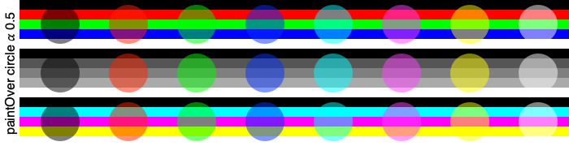
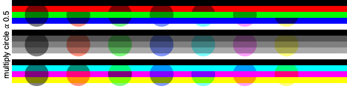
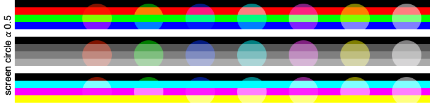
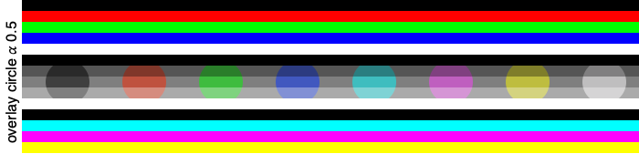
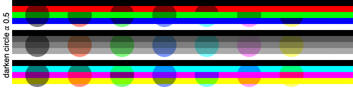
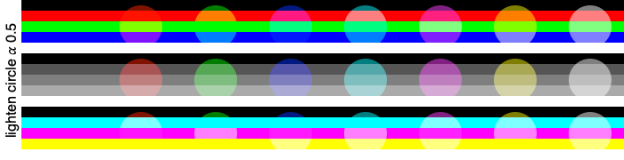
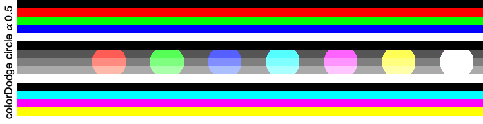
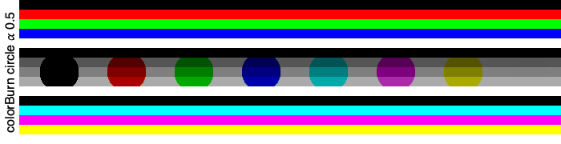

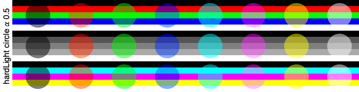
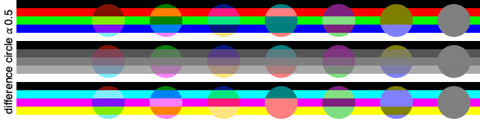
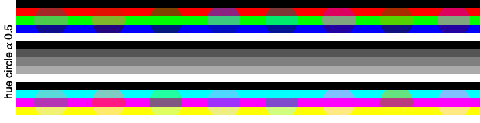
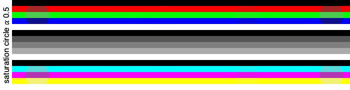
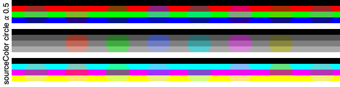
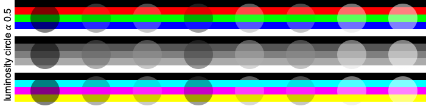
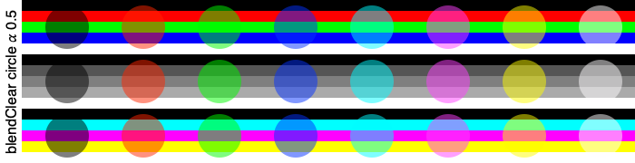
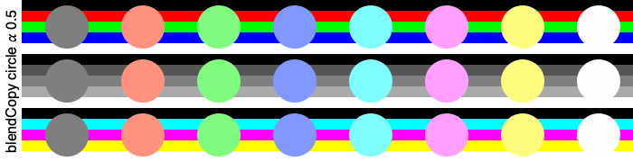
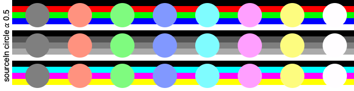
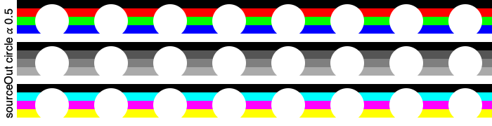

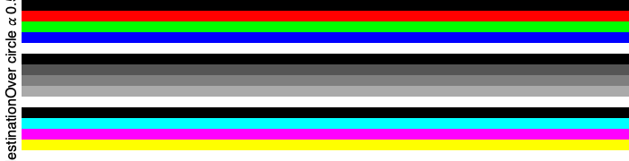
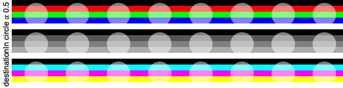

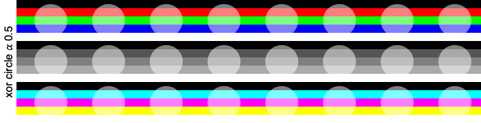
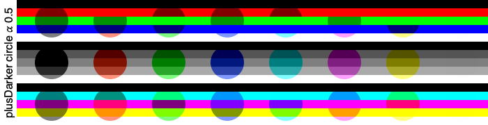
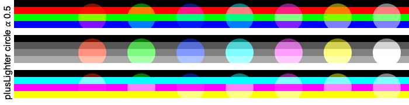 

And in this set, the canvas is painted with stripes of alpha 0.5, and the circles have alpha 1.0:

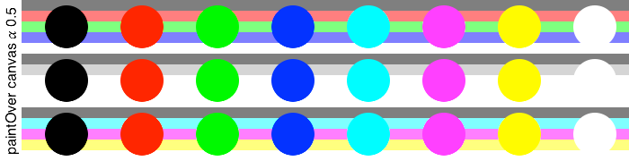
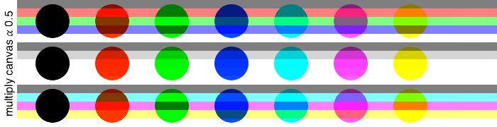
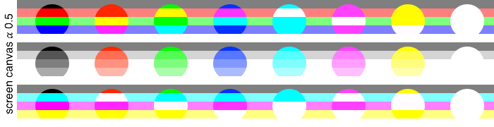
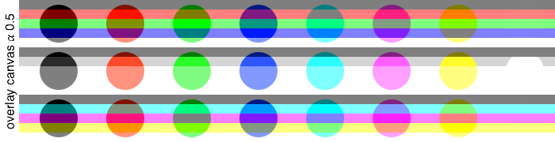
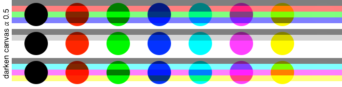
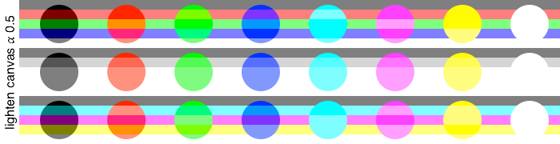
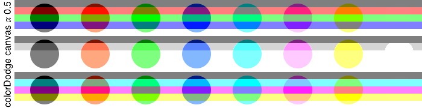
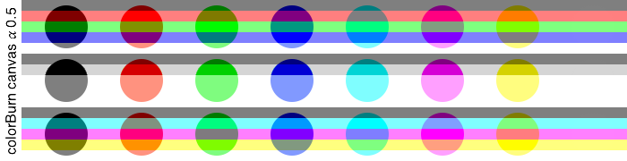
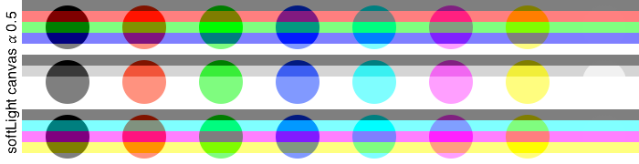
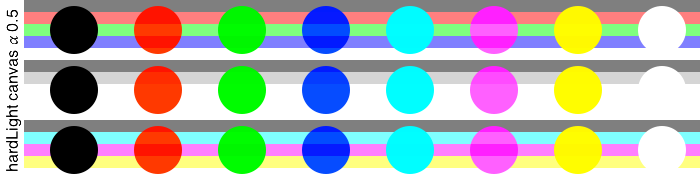
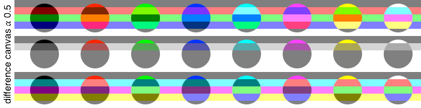
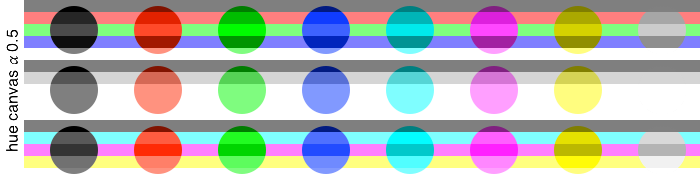
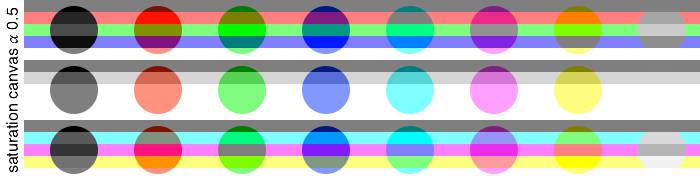
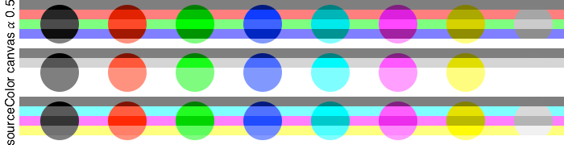
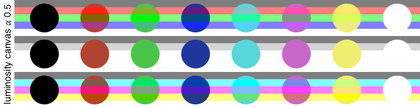
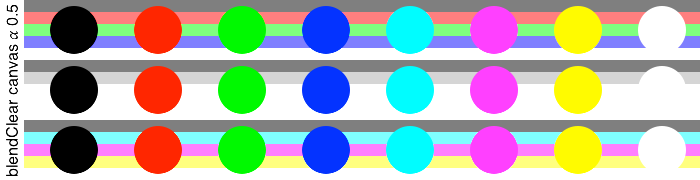

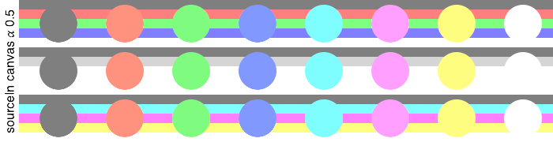
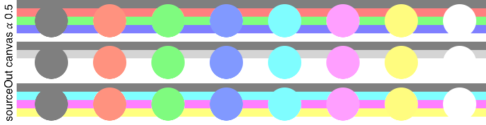

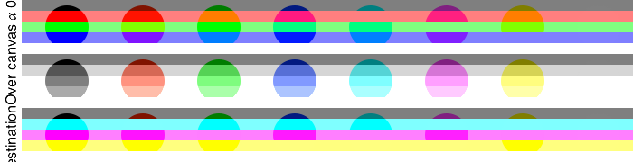
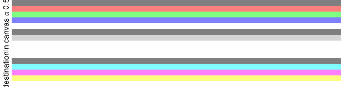

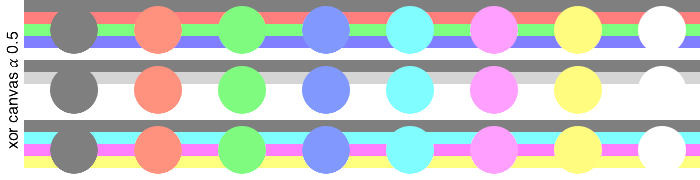
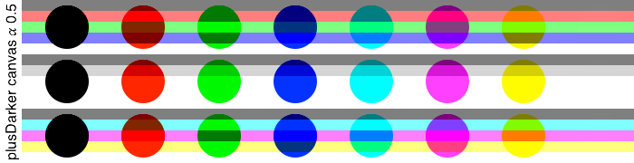
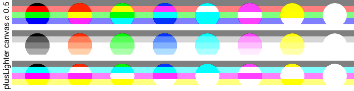 

 

#### parent topic: [Blend Modes](Colors2.md)  
