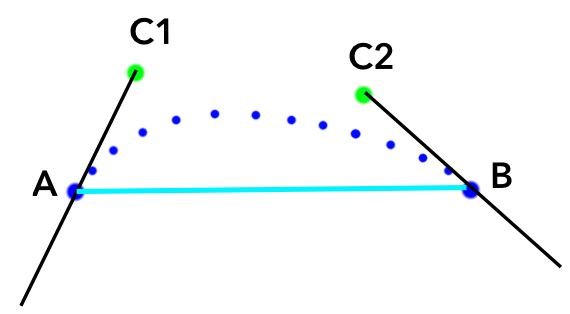
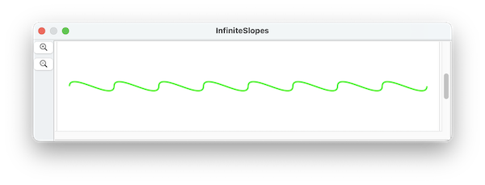
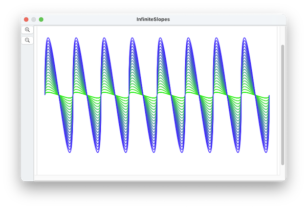

####  [Table of Contents](TableOfContents.md) 
#### previous topic: [Paths Part 2](TangentsAndSlopes.md)  next topic:  [Colors One](Colors1.md)

## Path Details

Each path has a set of anchor points, and each anchor point has a position and a tangent.  But you may be curious about how SinterPixels determines the exact arc that the path should take in between the points.

SinterPixels draws a cubic bezier curve from each point to the next. Cubic Bezier curves are defined by two control points in addition to the anchor points.  The position of the control points is determined as follows:



The two control points used are on the tangents of each anchor. The distance along the tangents is the same for both control points -- The distance is determined as a function of the distance between the anchors by this equation:

    D = S * sqrt(2) / 4
 
where S is the distance between A and B, and D is the distance between S and C1, and also the distance between B and C2.

## The tangent inertia

Although the default behavior for determining the control points works well in many cases, you may find cases where the shape of the arc isn't quite right. It is always possible to add more control points, but there is an additional tweak that SinterPixels allows.

To increase or decrease the distance of the control point away from the anchor point, each anchor has an additional property **inertia**  The default value is 1.0. If you specify a value for this property, the equation above is calculated separately for each control point and becomes

    Da = Ia * S * sqrt(2) / 4
    Db = Ib * S * sqrt(2) / 4

where Ia is the inertia for a anchor A and Ib is the inertia for anchor B.  Specifying large values for the inertia can produce paths that deviate quite far from the anchor points themselves.  Specifying inertia values of zero makes the anchor points behave like vertices of a polygon.

As an example, here's a path defined by a sequence of points on the x axis, each with infinite slope:



However, the path does not protrude very far in the y direction.  To increase the magnitude of the wave, the **inertia** property can be increased.  Here's a sequence of 20 paths, varying the inertia from 1 to 20, and changing the color at each step as well:



```
tell application "SinterPixels"
	set anchorData to {}
	repeat with n from -4 to 4
		set nextAnchor to {position:{n * 75, 0}, slope:infinity}
		set anchorData to anchorData & {nextAnchor}
	end repeat
	tell document 1
		repeat with n from 1 to 1
			set thePath to make new path with properties {closed:false, anchor data:anchorData, position:{0, 0}, line width:2, color:{0.2, (1.0 - n * 0.05), n * 0.05}, fill color:clear}
			set the inertia of every anchor of thePath to n
		end repeat
	end tell
end tell
```

#### previous topic: [Paths Part 2](TangentsAndSlopes.md)  next topic:  [Colors One](Colors1.md)
