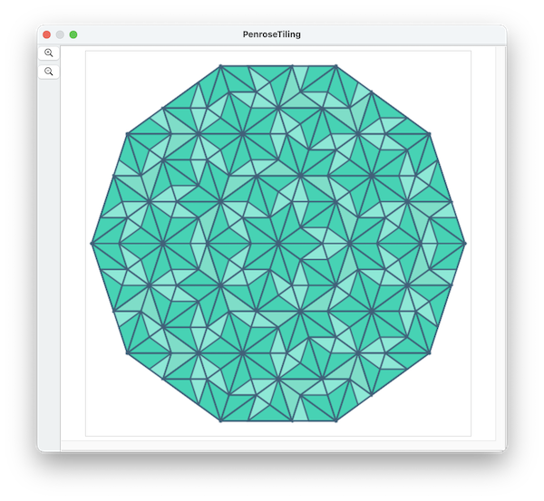
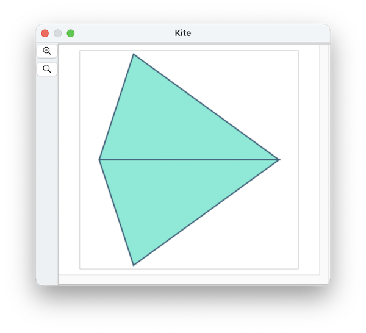
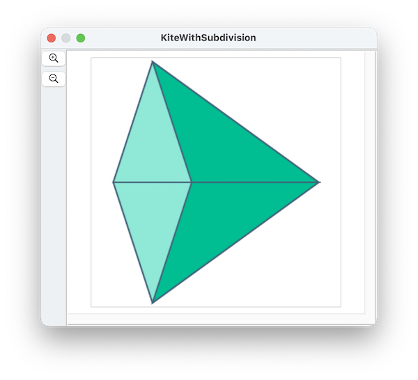
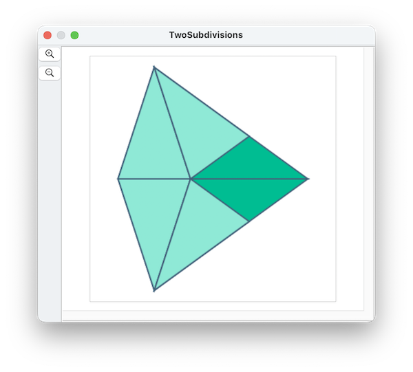
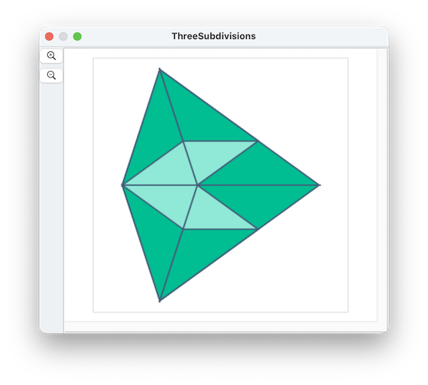
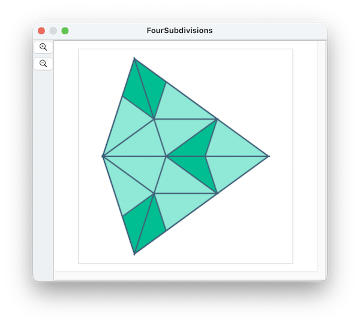
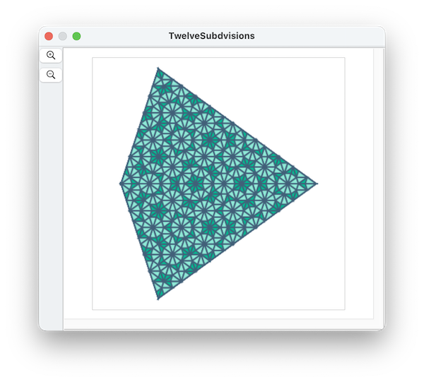

####  [Table of Contents](TableOfContents.md) 
#### Containing topic: [All Examples](AllExamples.md) 

##   A Colorful Penrose Tiling



Penrose tilings are a periodic -- they do not have translational symmetry.

There are patterns that repeat locally, but there are infinite variations so they never really repeat themselves.  Here's how the algorithm works:

First, we draw two triangles, each of which have angles of 72-72-36:



Then, we subdivide each triangle, so that each one makes a new smaller 72-72-36 triangle, and a second 36-36-108 triangle.  We divide them so they are mirror images of each other:



Let's call the 72-72-36 triangles "tall" and the 36-36-108 triangles "flat".  Each of the original triangles is now one tall triangle and one flat triangle.

Now its time to subdivide the flat triangles.  Subdividing each one also makes one tall and one flat triangle:



Each of the original triangles is now two tall triangles and one flat triangle.  Continuing by again subdividing the tall triangles:



Each of the original triangles is now two tall triangles and three flat triangles. Continuing by again subdividing the flat triangles:



Each of the original triangles is now five tall triangles and three flat triangles. Let's skip ahead eight steps 



Each of the original triangles is now 233 tall triangles and 144 flat triangles.
It is no coincidence that 144 and 233 are the twelfth and thirteenth Fibbonacci numbers.

Here's the script that implements the drawing:
The numDivisions parameter controls how many subdivisions will be done.

```
property invGoldenRatio : 2 / (1 + (5 ^ 0.5))
property sinPiOverFive : 0.587785252
property cosPiOverFive : 0.809016994
property lighterColor : {0.5, 0.9, 0.8, 1.0}
property darkerColor : {0.0, 0.7, 0.5, 1.0}
property darkLineColor : {0.2, 0.3, 0.4, 1.0}
property clearColor : {1.0, 1.0, 1.0, 0.0}

to makeATriangle(pt1, pt2, pt3, fc, lc)
	tell application "SinterPixels"
		tell document 1
			make new polygon with properties {position:{0, 0}, vertex:{{x of pt1, y of pt1}, {x of pt2, y of pt2}, {x of pt3, y of pt3}}, fill color:fc, line width:2, color:lc}
		end tell
	end tell
end makeATriangle

to subdivideB(pt1, pt2, pt3, numSubdivisions)
	set delX to (x of pt3) - (x of pt1)
	set delY to (y of pt3) - (y of pt1)
	set pt4 to {x:(x of pt3) - delX * invGoldenRatio, y:(y of pt3) - delY * invGoldenRatio}
	if numSubdivisions is less than 3 then
		makeATriangle(pt1, pt2, pt3, darkerColor, darkLineColor)
	end if
	if (numSubdivisions > 1) then
		subdivideA(pt2, pt3, pt4, numSubdivisions - 1)
	end if
	if (numSubdivisions > 2) then
		subdivideB(pt2, pt4, pt1, numSubdivisions - 2)
	end if
end subdivideB
to subdivideA(pt1, pt2, pt3, numSubdivisions)
	set delX to (x of pt2) - (x of pt1)
	set delY to (y of pt2) - (y of pt1)
	set pt4 to {x:(x of pt2) - delX * invGoldenRatio, y:(y of pt2) - delY * invGoldenRatio}
	if numSubdivisions is less than 3 then
		makeATriangle(pt1, pt2, pt3, lighterColor, darkLineColor)
	end if
	if (numSubdivisions > 2) then
		subdivideA(pt4, pt3, pt1, numSubdivisions - 2)
	end if
	if (numSubdivisions > 1) then
		subdivideB(pt2, pt4, pt3, numSubdivisions - 1)
	end if
end subdivideA

set centerX to 140
set centerY to 0
set len to 280
set numDivisions to 9

-- ptList is three points of a regular decagon 
set ptList to {{x:-len * cosPiOverFive, y:len * sinPiOverFive}, {x:-len, y:0}, {x:-len * cosPiOverFive, y:-len * sinPiOverFive}}

set centerPt to {x:centerX, y:centerY}
set pt1 to {x:centerX + (x of item 1 of ptList), y:centerY + (y of item 1 of ptList)}
set pt2 to {x:centerX + (x of item 2 of ptList), y:centerY + (y of item 2 of ptList)}
set pt3 to {x:centerX + (x of item 3 of ptList), y:centerY + (y of item 3 of ptList)}
subdivideA(pt2, centerPt, pt1, numDivisions)
subdivideA(pt2, centerPt, pt3, numDivisions)
```
  
#### Containing topic: [All Examples](AllExamples.md) 
