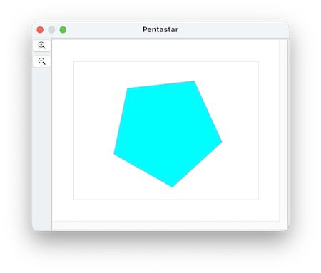
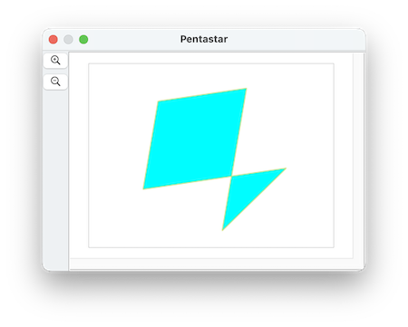
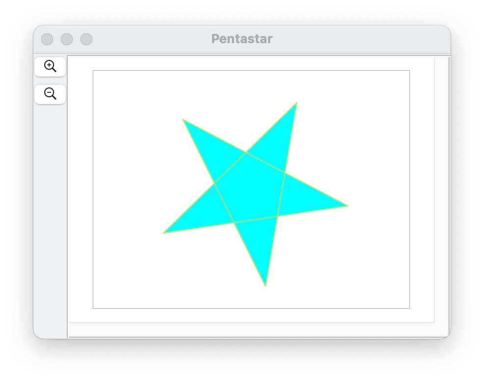

####  [Table of Contents](TableOfContents.md) 
#### Containing topic: [All Examples](AllExamples.md) 

## 　Another way to make a star

In the [Polygons Part 2](SinterpixelsPolygons2.md)  page we showed how to make a five-pointed star by making a 10-sided polygon, and setting the radius of every other vertex to a smaller value.  Here we'll discuss how to make a star a different way.

First we'll start by making a regular pentagon:



by running this script:

```
tell application "SinterPixels"
	if not (exists document 1) then make new document
	tell document 1
		make new polygon with properties {fill color:cyan, position:{0, 0}, vertex count:5, radius:100}
	end tell
end tell
```

Please note that the five vertices of the pentagon are the same vertices we need to draw a star, but when we draw a star, we hit the vertices in a different order.  That is, if the pentagon is a polygon ABCDE, to draw a star, we want to draw the polygon ACEBD.  All we need to is move the vertices into a different order.
 
Lets give our vertices names by running this script:
 
```
tell application "SinterPixels"
	tell polygon 1 of document 1
		set name of vertex 1 to "A"
		set name of vertex 2 to "B"
		set name of vertex 3 to "C"
		set name of vertex 4 to "D"
		set name of vertex 5 to "E"
	end tell
end tell
```
 
So, starting with ABCDE, lets move the B vertex ('vertex 2') to after the E vertex by running this script:
 
```
 tell application "SinterPixels"
	tell polygon 1 of document 1
		move vertex "B" to after vertex "E"
	end tell
end tell
```
 
The result is this ACDEB pentagon:
 


Now move vertex D to after vertex B by running this script:

```
 tell application "SinterPixels"
	tell polygon 1 of document 1
		move vertex "D" to after vertex "B"
	end tell
end tell
```

And we have our result, a ACEBD pentagon that makes the shape of a perfect five-pointed star



#### Containing topic: [All Examples](AllExamples.md) 
