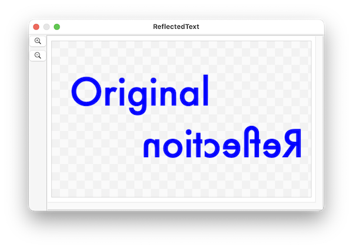
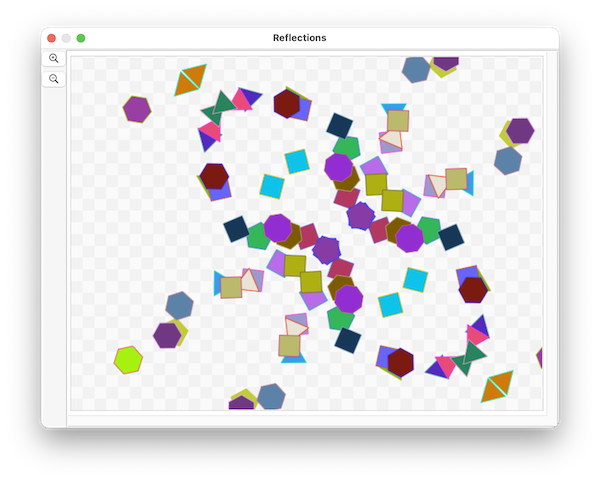

####  [Table of Contents](TableOfContents.md) 
#### previous topic: [Copying a Shape](DuplicateVerb.md)   next topic: [Creating a Document](NewDocument.md)


## Making a Mirror Image of a Shape

Reflection is a new feature in version 26.4.3

SinterPixels shapes understand the **reflect** action.  This transforms the shape into a mirror image of itself.

Along with the reflect command, a **mirror direction** parameter is required. This direction specifies the direction of the line that acts as a mirror for the reflection operation.  For example, if you specify 

```
mirror direction {0, 1}
```

The shape will be reflected across the y axis.

Here's a script that illustrates using the reflect action on a text shape:



```
tell application "SinterPixels"
	set doc1 to make new document with properties {height:300, width:500}
	tell doc1
		set t to make new text shape with properties {position:{-80, 50}, font:"Futura", text content:"Original", font size:72, fill color:blue, line width:0}
		set dupe to duplicate t
		set text content of t to "Reflection"
		set position of t to {-80, -50}
		reflect t mirror direction {0, 1}
	end tell
end tell
```

A reflect action can also include a **mirror point** parameter.  This parameter specifies a point on the line which acts as a mirror, allowing the exact position of a mirror to be specified.  By default, the mirror point is {0, 0}

Here's a script which uses reflections in two different mirrors to create a set of randomly positioned shapes and three duplicates of each shape, thus creating a arrangemnt of shapes with some symmetry.



```
to makeReflections(s)
	tell application "SinterPixels"
		set dupeA to duplicate s
		reflect dupeA mirror point {50, 0} mirror direction {1, 1}
		set dupeB to duplicate s
		reflect dupeB mirror point {50, 0} mirror direction {-1, 1}
		set dupeC to duplicate dupeA
		reflect dupeC mirror point {50, 0} mirror direction {-1, 1}
	end tell
end makeReflections
tell application "SinterPixels"
	tell document 1
		repeat 25 times
			set newPoly to make new polygon with properties {radius:20}
			my makeReflections(newPoly)
		end repeat
	end tell
end tell
```

 
#### previous topic: [Copying a Shape](DuplicateVerb.md)   next topic: [Creating a Document](NewDocument.md)
