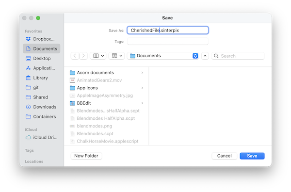

####  [Table of Contents](TableOfContents.md) 
#### previous topic: [Exporting Movies](Movies.md)    next topic: [Scripting In Depth A: Script Editor](ScriptEditor.md)

## Saving A Document 

SinterPixels supports the traditional way of saving a file -- choose "Save..." from the File menu to get to the traditional save panel.  Using Apple's Save Panel allows SinterPixels access to anywhere in your storage that you choose.

Saving is of course also supported via the scripting interface.  However, because of Apple's strict guardrails for an application's access to your disk, this is sometimes not straightforward.

If the file is already saved to disk, that likely means that SinterPixels already has permissions for that location, so the following script will work without any user interaction:

tell application "SinterPixels"
    save document 1
end tell

If, however, there is no existing file for the document, that script will put up a save dialog asking for one.  Even if you specify a file location like this:

tell application "SinterPixels"
    save document 1 in file "Macintosh HD:users:olof:Documents:My file.sinterpixels"
end tell

SinterPixels may need to put up a dialog asking for your permission to access that location on disk.

## The library

(support for this feature is in version 26.2.3)

However, there are a few places that SinterPixels will always be allowed to access, and one of those is its application support folder. SinterPixels create a special folder there called "Library", and if files are placed there they can always be access, either opened or saved.

A file in this special folder can be opened with a script like this:

tell application "SinterPixels"
    open file "My Filename" of the library
end tell
 
To save a file in this folder, one can use

tell application "SinterPixels"
    save document 1 in the library filename "Any filename"
end tell

#### previous topic: [Exporting Movies](Movies.md)   next topic: [Scripting In Depth A: Script Editor](ScriptEditor.md)
