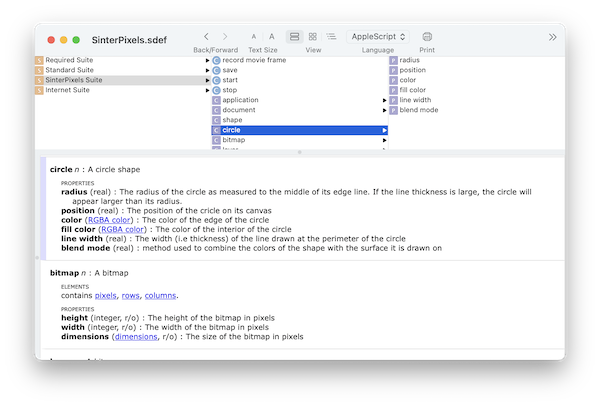
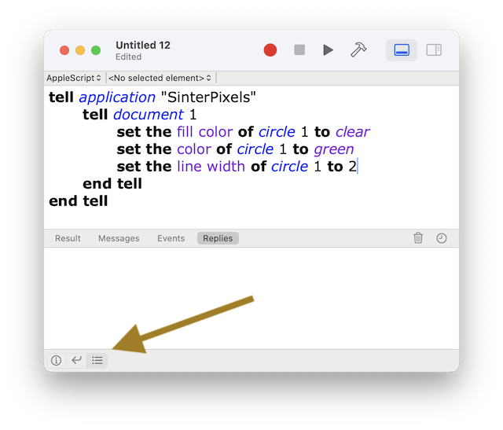

####  [Table of Contents](TableOfContents.md) 
#### previous topic: [Exporting Movies](Movies.md)  next topic: [Scripting In Depth B: Scripts Menu](ScriptsMenu.md)

## The Script Editor

Script Editor is a fairly simple app, but there are some features which are useful to know about:

### Recording

SinterPixels _almost_ supports a feature called AppleScript recording, but there is currently an issue where enabling recording actually causes macOS to send events twice. Perhaps this feature can be enabled in the future.

### App Dictionaries

The terminology understood by each application is presented in its scripting dictionary.  To open an app's dictionary, choose "Open Dictionary..." from Script Editor's File menu, and select the app you want to inspect.  SinterPixels's dictionary looks like this

Most helpfully, the scripting dictionary documents the various properties available for each object type, and defines the various parameters available for each command.

### The Events Panel

By default, Script Editor shows the result of the last command in the lower part of its window.  However, one can have it display a more comprehensive record of its communications with the app.  Select the "Log" button on the lower bar -- its shown here in this picture:

Then, select the "Replies" button to see the full transaction between Script Editor and the app.  The lower panel should show each command it sent to the app, and each reply it received.

#### previous topic: [Exporting Movies](Movies.md)  next topic: [Scripting In Depth B: Scripts Menu](ScriptsMenu.md)
