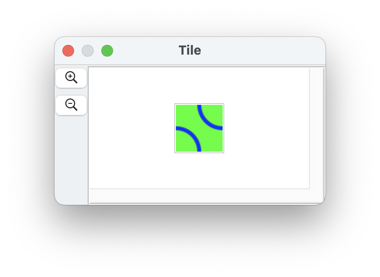
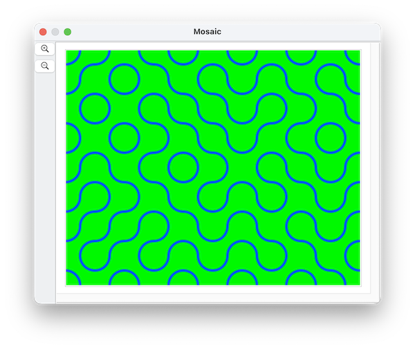

####  [Table of Contents](TableOfContents.md) 
#### previous topic: [Pixels](SinterpixelsPixels.md)  next topic: [Movies](Movies.md)

##  Layers

(n.b.: some layer functionality is updated in version 26.3.2)

Every document has a canvas, which consists of a background of pixels and an overlay of different shapes

A layer is essentially another canvas, which can have its own size, its own bitmap background and its own set of shapes.  Layers are positioned relative to the main canvas, but they can move independently of the main canvas.

If multiple layers are defined, they stack on top of each other.

Unlike some other graphics programs that have layers, the size and position of a layer are unconstrained by the main canvas -- they exist on their own, but only draw the parts of themselves that overlap the main canvas.

when making a new layer, the property **image data** can be used to fill its canvas

Here's a script that makes a 48 x 48 document, copies its PNG data, and uses that data to initialize a bunch of layers in the second document, using them as tiles:

```
tell application "SinterPixels"	
	set tileDoc to make new document with properties {name:"Tile", height:48, width:48}
	tell tileDoc
		set color of every pixel to green
		make new circle with properties {position:{24, 24}, radius:24, color:blue, fill color:clear, line width:4}
		make new circle with properties {position:{-24, -24}, radius:24, color:blue, fill color:clear, line width:4}
		set tilePNG to get PNG data
	end tell
	
	set mosaicDoc to make new document with properties {name:"Mosaic", height:384, width:480}
	
	repeat with x from 1 to 10
		repeat with y from 1 to 8
			set newPosition to {(x * 48) - 264, (y * 48) - 216}
			set newRotation to some item of {0, 90}
			tell mosaicDoc
				set nthLayer to make new layer with properties {image data:tilePNG, rotation:newRotation, position:newPosition}
			end tell
		end repeat
	end repeat
end tell
``` 

The first document with the 48 x 48 tile looks like this:


The mosaic of 80 separate tiles, each with a random rotation, looks like this:



This can be used to define a layer for use as a "sprite" in an animation.
 
 
Examples: 
[Using blendCopy to punch through a layer](BlendCopyPunchThroughExample.md) 


#### previous topic: [Pixels](SinterpixelsPixels.md)  next topic: [Movies](Movies.md)
