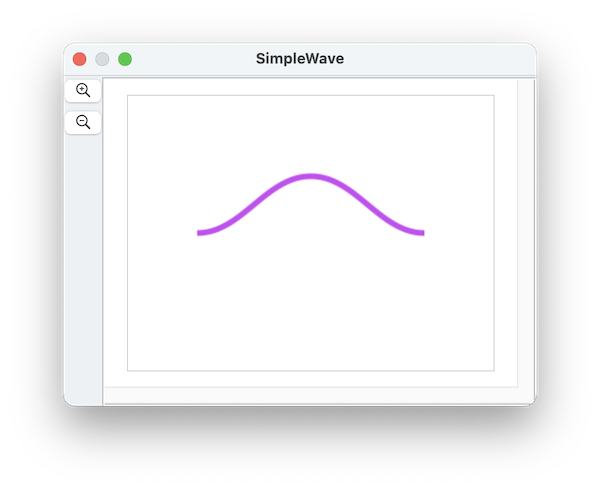
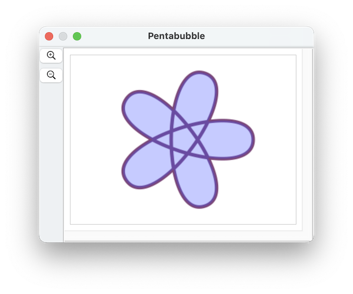
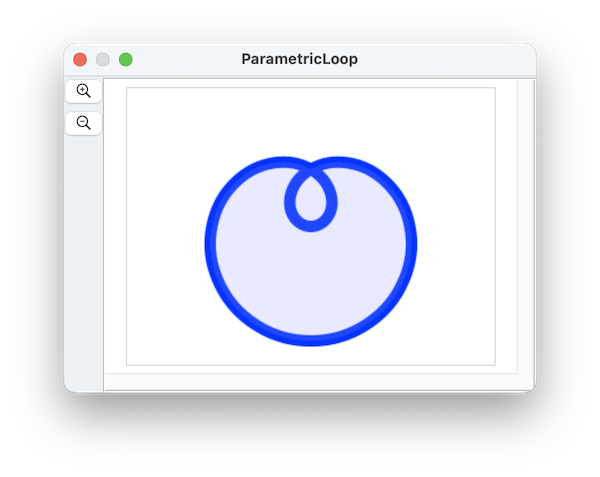

####  [Table of Contents](TableOfContents.md) 
#### previous topic: [Text Shapes 3](TextShapes.md)  next topic:  [Paths Part 2](TangentsAndSlopes.md))

## Paths

Paths are represented by a sequence of points, each of which has a **position** and a **tangent**.

The tangent can be specified in a few different ways, but the default is to specify an angle in degrees.  A tangent of zero is horizontal (pointing right), and a tangent of 90 is vertical (pointing up).

For example, a wavy line might be three points, each with a tangent of 0:

 

which is made by this script:

```
tell application "SinterPixels"
	tell document 1
		set a1 to {position:{-100, 0}, tangent:0}
		set a2 to {position:{0, 50}, tangent:0}
		set a3 to {position:{100, 0}, tangent:0}		
		set thePath to make new path with properties {anchor data:{a1, a2, a3}, position:{0, 0}, line width:5}	
	end tell
end tell
```

In this case, the first point is the beginning of the path on the left, the second point is the middle of the path, and the third point is the end of the path on the right.
 
Paths have a **closed** property.  If closed is true, the beginning and the end of the path are connected.
 
Paths can be filled.  By default, the **fill color** of a path is clear.  To fill a path, set the fill color to a non-clear color.

##Path Examples

 
[Pentabubble](Pentabubble.md)

 
[Parametric Loop](ParametricLoop.md) 


#### previous topic: [Text Shapes 3](TextShapes.md)  next topic:  [Paths Part 2](TangentsAndSlopes.md)
