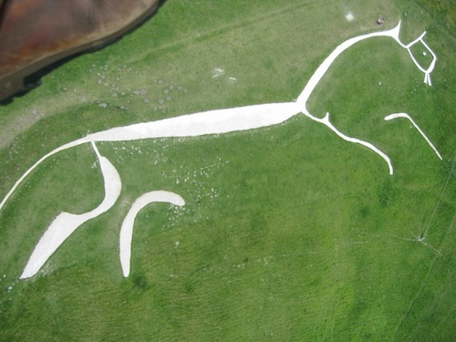

#### previous topic: [Pixels Part 1](SinterpixelsPixels.md) next topic: [Pixels Part 3](SinterpixelsPixels3.md)

##  Pixels part 2: Getting colors

Lets explore what properties are available for pixels:

```
tell application "SinterPixels"
	tell document 1
		get properties of pixel {1,1}
	end tell
end tell
```

As log as document 1 exists, this should return something like this:

```
{id:{1, 1}, 
 index:1, 
 position:{x coordinate: -319.5, y coordinate: 239.5},
 color:{green component:0.0, blue component:0.0, red component:0.0, alpha component:0.0}
}
```

Interestingly, that's all the information you need to correlate the position of a pixel with the position of shapes on the convas.  Let's do something interesting with that information: create a pixellated version of an image by drawing shapes.  Load an interesting image into a document by opening a .png or jpeg.  Then run this script to create an interesting distorted version of the original composed only of circles, where the colors of the circles reflect the colors of the the original:

 

```

tell application "SinterPixels"
	set doc1 to get document 1
	set h1 to height of doc1
	set w1 to width of doc1
	set aspectRatio to h1 / w1
	set w2 to 500
	set h2 to 500 * aspectRatio
	set mag to 500 / w1
	set doc2 to make new document with properties {width:500, height:h2}
	
	set stepSize to w1 / 25
	set stepSize2 to stepSize * mag
	set ySteps to h1 / stepSize
	repeat with x from 1 to 25
		set xID1 to (x * stepSize) - (stepSize / 2)
		set xPos2 to (xID1 * mag) - (w2 / 2)
		repeat with y from 1 to ySteps
			set yID1 to (y * stepSize) - (stepSize / 2)
			set yPos2 to (h2 / 2) - (yID1 * mag)
			tell doc1
				set pixelColor to get color of pixel id {{xID1, yID1}}
			end tell
			tell doc2
				make new circle with properties {radius:10, line width:0, position:{xPos2, yPos2}, fill color:pixelColor}
			end tell
		end repeat
	end repeat
	repeat with x from 1 to 24
		set xID1 to (x * stepSize)
		set xPos2 to (xID1 * mag) - (w2 / 2)
		repeat with y from 1 to (ySteps - 1)
			set yID1 to (y * stepSize)
			set yPos2 to (h2 / 2) - (yID1 * mag)
			tell doc1
				set pixelColor to get color of pixel id {{xID1, yID1}}
			end tell
			tell doc2
				make new circle with properties {radius:9, line width:1, color:black, position:{xPos2, yPos2}, fill color:pixelColor}
			end tell
		end repeat
	end repeat
end tell
```

#### previous topic: [Pixels Part 1](SinterpixelsPixels.md)  next topic: [Pixels Part 3](SinterpixelsPixels3.md)
