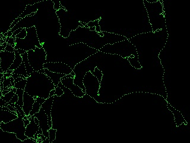

#### previous topic: [Pixels Part 2](SinterpixelsPixels2.md)  next topic: [Layers](SinterpixelsLayers.md)

##  Pixels part 3: Setting colors

Every document starts with a canvas, and every canvas has a background of pixels. If a new document is created, the background of pixels is transparent, but if a document is created from a PNG file, most of the pixels will probably be filled in.

The individual components of the colors of each pixel can be manipulated by a script.  Here's a script that fills in the whole canvas with a yellow/blue gradient:

[Pixel Gradient Example](PixelGradientExample.md)

```
tell application "SinterPixels"
	tell document 1
		set alpha component of every pixel to 1.0
		set ht to height of canvas
		set wt to width of canvas
		repeat with h from 1 to ht
			set red component of every pixel of row h to h / ht
			set blue component of every pixel of row h to h / ht
		end repeat
		repeat with w from 1 to wt
			set green component of every pixel of column w to w / wt
		end repeat
	end tell
end tell
```


In the above script we used "every pixel of row h" and "every pixel of column w" to set the color of many pixels at the same time.  We can also set the colors of the pixels individually like this:

```
tell application "SinterPixels"
	tell document 1
		set the alpha component of every pixel of the canvas to 1.0
		set ht to height of canvas
		set wt to width of canvas
		repeat with h from 1 to ht
			repeat with w from 1 to wt
				set green component of pixel id {w, h} to 1.0
			end repeat
		end repeat
	end tell
end tell
```

But that script is really slow! AppleScript isn't very performant, and if you can avoid setting each pixel individually like that, you probably should.

But there are some cases where setting a color pixel by pixel is interesting.  Here's a script which shows a random walk over the canvas:




```
set {dx, dy} to {0.0, 0.0} -- this is the speed
set drag to 1.1
set randList to {-1, -0.7, 0, 0.7, 1.0}
tell application "SinterPixels"
	tell document 1
		set the color of every pixel of the canvas to black
		set {ht, wt} to {height, width} of canvas
		set {maxx, maxy} to {wt, ht}
		set {minx, miny} to {0, 0}
		set {x, y} to {maxx / 2, maxy / 2} -- this is the current location
		repeat 1000 times
			set dx to dx / drag + (some item of randList)
			set dy to dy / drag + (some item of randList)
			set x to x + dx
			set y to y + dy
			set green component of pixel id {x, y} of the canvas to 1.0
			if y > maxy or y < miny then
				set dy to dy * -1.0
			end if
			if x > maxx or x < minx then
				set dx to dx * -1.0
			end if
		end repeat
	end tell
end tell
```

Try playing with different values of "drag"

#### previous topic: [Pixels Part 2](SinterpixelsPixels2.md)  next topic: [Layers](SinterpixelsLayers.md)
