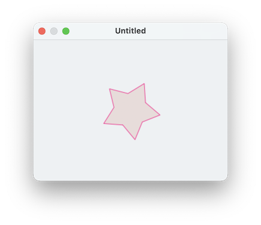
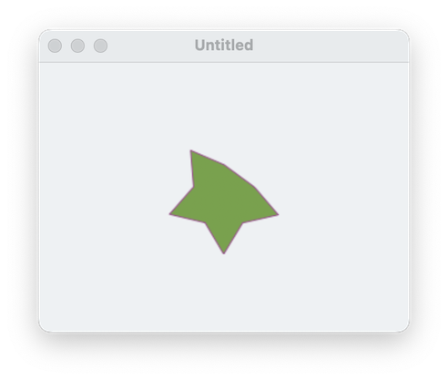

####  [Table of Contents](TableOfContents.md) 
#### previous topic: [Polygons Part One](SinterpixelsPolygons1.md)  next topic:  [Polygons Part Three](SinterpixelsPolygons3.md)

## Polygons Part Two: Vertices 

If we make a polygon without specifying any properties, we'll get a regular polygon with a random number of vertices.  We can specify the number of vertices like this:

```
make new circle with properties {vertex count: 5}
```

but it will still be a regular polygon.  What if we don't want a regular polygon?  The key to this question is understanding that the vertices of each polygon are themselves scriptable.  Run the following script to see what happens:


```
tell application "SinterPixels"
	if not (exists document 1) then make new document
	tell document 1
		set p to make new polygon with properties {vertex count:5, radius:20}
		get vertices of p
	end tell
end tell
```

The result should be a list of five objects, each one that can have properties of its own.  Try this to see what properties a vertex has:

```
tell application "SinterPixels"
	tell document 1
		get properties of vertex 1 of polygon 1
	end tell
end tell
```
 
You should find the result to be something like this:

```
{container:polygon id 8 of canvas id 4 of application "SinterPixels", 
 name:"", 
 id:9, 
 class:vertex, 
 radius:20.0, 
 angle:1.25663
}
```

Like most objects, each vertex has a **name**, **container**, **id**, and **class**.  Unique to the vertex, however, is a **radius** and an **angle**.  These define the position of each vertex relative to the position of the polygon itself.

Try adjusting the position of the radius of just one of the vertices (this script is almost identical to the script we used for adjusting the radius of a circle):

```
tell application "SinterPixels"
	tell document 1
		set p to make new polygon with properties {position: {0, 0}}
		set originalRadius to radius of vertex 1 of p
		repeat with newR from originalRadius to 100
			set the radius of vertex 1 of p to newR
		end repeat
		repeat with newR from 100 to originalRadius by -1
			set the radius of vertex 1 of p to newR
		end repeat
	end tell
end tell
```

So, to make a star, one would want to set the radius of every other vertex to be smaller than the others: 

```
tell application "SinterPixels"
	tell document 1
		set p to make new polygon with properties {position: {0, 0}, vertex count 10, radius 50}
		set the radius of vertices {2,4,6,8,10} of p to 28
	end tell
end tell
```



This script uses a shorthand for referring to the five even-numbered vertices.  " vertices {2,4,6,8,10} of p" means "the five vertices with indices 2, 4, 6, 8, and 10", so the command 

```
    set the radius of vertices {2,4,6,8,10} of p to 28
```

sends the message "set the radius to 28" a total of 5 times, once to each of the 5 vertices independently.  Try the script with different radii or vertex count to get a different star.


Now, you might understand why it doesn't make as much sense to change the vertex count of a polygon by manipulating its vertex count property.  Instead, if we want to change the number of vertices, we need to make a new vertex, or delete an existing one.  try adding a line to the previous script:

```
tell application "SinterPixels"
	tell document 1
		set p to make new polygon with properties {position: {0, 0}, vertex count 10, radius 50}
		set the radius of vertices {2,4,6,8,10} of p to 28
		delete vertex 1 of p
	end tell
end tell
```

The result is a star with one vertex missing:



#### previous topic: [Polygons Part One](SinterpixelsPolygons1.md)  next topic: [Polygons Part Three](SinterpixelsPolygons3.md)
