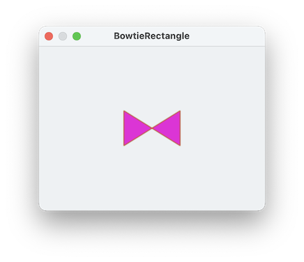

####  [Table of Contents](TableOfContents.md) 
#### previous topic: [Polygons Part 2](SinterpixelsPolygons2.md)  next topic: [Specifying Colors](Colors1.md)

## Polygons Part Three: Irregular Vertices

There are other ways to specify vertices of a polygon.  Although radial coordinates are often convenient, using x and y coordinates works fine as well: This script makes a nice golden rectangle

```
set yc to 20
set xc to yc * 1.61
tell application "SinterPixels"
	tell document 1
		set p to make new polygon with properties {position: {0,0}, vertices:{{xc,yc},{-xc,yc},{-xc,-yc},{xc,-yc}} }
	end tell
end tell
```
 
Being able to specify the vertices individually means there no need for them to go smoothly around a circle.  Here's the same script with the order of the vertices jumbled:

```
set yc to 
set xc to yc * 1.61
tell application "SinterPixels"
	tell document 1
		set p to make new polygon with properties      {vertices:{{xc,yc},{-xc,-yc},{-xc,yc},{xc,-yc}}
	end tell
end tell
```

which makes a very nice looking bowtie:



Note:  Although this looks like two separate triangles, it is instead a single rectangle.  We've taken a regular golden rectangle ABCD and instead drawn it as ACBD.  Because it is a golden rectangle, the resulting triangle shapes are regular equilateral triangles.

#### previous topic: [Polygons Part 2](SinterpixelsPolygons2.md)  next topic: [Specifying Colors](Colors1.md)
