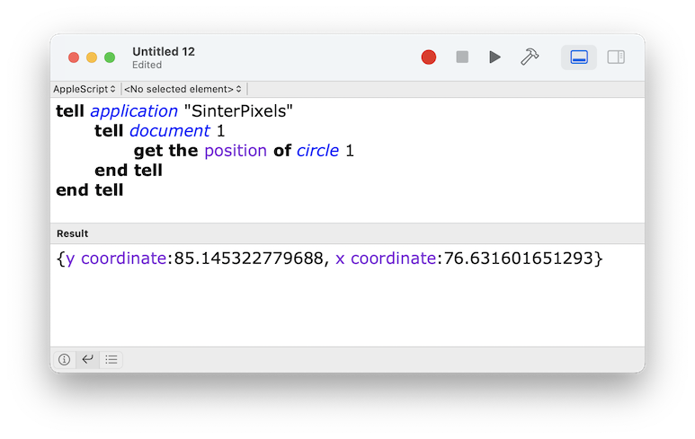

#### previous topic: [The Scripting Interface](TheScriptingInterface.md)  next topic: [Shapes Part Two - Colors](SinterpixelsShapes2.md)

## Shapes Part One: position

There are currently two kinds of shapes in Sinterpixels: the circle and the polygon

Circles and polygons have a few properties in common.  Lets do these examples with circles, which are a bit simpler. If you don't already have a document open, make a new one now.  And if the document doesn't contain a circle, make one now with the following script:

```
tell application "SinterPixels"
	tell document 1
		make new circle
	end tell
end tell
```

Because we didn't specify any information about the circle's color or position, these properties were chosen at random. Let's find out how Sinterpixels understands a shape's position by running the following script:

```
tell application "SinterPixels"
	tell document 1
		get the position of circle 1
	end tell
end tell
```

after running this script, you should see the result in the script editor window:



In this example, the position is returned as

```
{y coordinate:85.145322779688, x coordinate:76.631601651293}
```

This is an AppleScript record.  Enclosed in curly braces is a sequence of key-value pairs.  Here, "y coordinate" is a key and 85.145322779688 is its value. "x coordinate" is another key and 76.631601651293 is its value.

In the Script Editor result, you'll notice "x coordinate" and "y coordinate" appear in blue.  This is a hint that these words are part of the Sinterpixels vocabulary.

In your example, you likely have different values for these coordinates, as they were chosen at random.

Now lets make the position less random bu setting the position of the circle to a new value.  Run the following script (Note that the order of "x coordinate" and "y coordinate" here don't matter):

```
tell application "SinterPixels"
	tell document 1
		set the position of circle 1 to {x coordinate:0, y coordinate:0}
	end tell
end tell
```

What should happen is that the circle will move to the center of the document.
Coordinates in Sinterpixels are measured from the center of the canvas.  negative x values are toward the left.  negative y values are toward the bottom.

Now lets try using a specific position when making  some new circles.  Run the following script:
 
```
tell application "SinterPixels"
	tell document 1
	    repeat with n from 0 to 4
		    make new circle with properties {position: {x coordinate:n*25, y coordinate:50}}
		end
	end tell
end tell
```

You should see something like this in your document:


What happened?  The section starting with "repeat with n from 0 to 4" and ending with end repeat caused the line between those to happen 5 different times, each time n had a different value.  The first time, n had the value 0, so a new circle was created at x=0, y=50.  The x value increased by 25 each time through the loop, because we specified n*25 for the x position of the new circle

The middle of the 5 new circles has a position of x=50, y=50, so it appears exactly 45 degrees up and to the right of the first circle which we moved to x=0, y=0

To summarize:

The **position** determines where a shape is drawn in its container.  In general, the position {0,0} draws a shape in the middle of its container

**x coordinate** and **y coordinate** can be used to access the individual components of the position.


Handy Tip:

If you are tired of writing out "x coordinate" and "y coordinate" all the time, you can just use a list without keys, but in this case the order does matter.  x is always first, and y is second.  go ahead and try:

```
tell application "SinterPixels"
	tell document 1
		set the position of circle 1 to {-50, -50}
	end tell
end tell
```


#### previous topic: [The Scripting Interface](TheScriptingInterface.md)  next topic: [Shapes Part Two - Colors](SinterpixelsShapes2.md)
