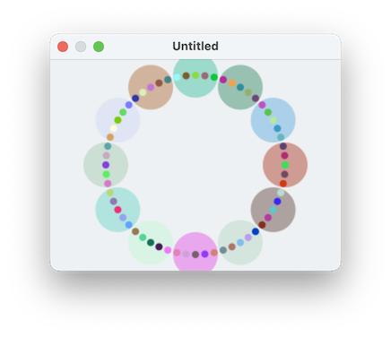

####  [Table of Contents](TableOfContents.md) 
#### previous topic: [Shapes Part Two](SinterpixelsShapes2.md)  next topic: [Circles](SinterpixelsCircles.md)

## Shapes Part Three:  Radial Coordinates

The position of a shape can also be expressed in radial coordinates.  That is, with a **radius** and an **angle**.  The radius means the distance from the center point x=0, y=0.  The **angle** means the number of radians around a circle (going counterclockwise) from the direction towards the right (the positive x axis).

Here's a script which makes something that might resemble a clock:




```
set rad to 100
set hoursSize to 25
set minutesSize to 4
set twoPi to 6.283

tell application "SinterPixels"
	repeat with n from 1 to 60
		tell document 1
			set ang to n * twoPi / 60
			if n mod 5 is equal to 0 then
				set theCircle to make new circle with properties {radius:hoursSize, line width:0, position:{angle:ang, radius:rad}}
				set alpha component of the fill color of theCircle to 0.4
			end if
			make new circle with properties {radius:minutesSize, line width:0, position:{angle:ang, radius:rad}}
		end tell
	end repeat
end tell
```
 
In this script, the line
```
if n mod 5 is equal to 0 
```
checks to see if the number n is divisible by 5.  If it is, the script draws an extra, bigger circle

Examples: 
[Color Spirals](ColorSpiralsExample.md) 

#### previous topic: [Shapes Part Two](SinterpixelsShapes2.md)  next topic: [Circles](SinterpixelsCircles.md)
