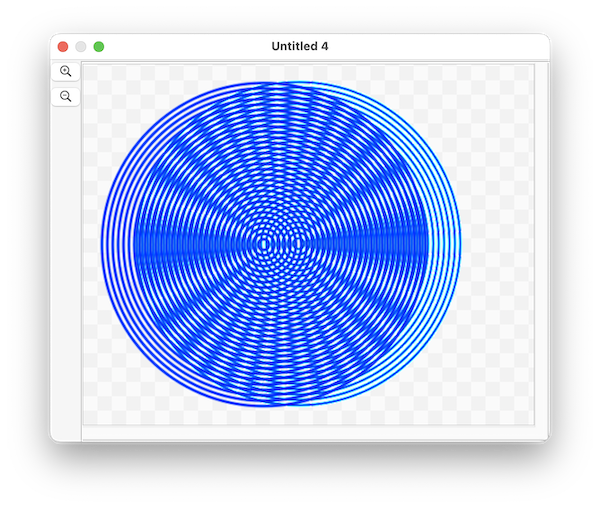

####  [Table of Contents](TableOfContents.md) 
#### previous topic: [Layers](SinterpixelsLayers.md)  Next topic: [Movies](Movies.md)

## Subrects

One may want to copy the data for just a portion of a document.  In this case, it can be useful to refer to a **subrect**

A subrect is not an object on its own, but rather refers to a rectangular region of the document.  One can refer to one like this:

```
tell application "SinterPixels"
	subrect id {500, 200, 200, 500} of document 1	
end tell
```

A subrect has properties of **bounds**, **PNG data** and **JPEG data**

copying the PNG data can be useful for initializing a layer, as in this example, which creates a circular moire pattern:

 
 
First, the script makes 30 concentric circles, slightly offset to the left of the image.  Then the PNG data for a 380 by 380 region is copied, and used as the image data when creating a new layer, which is placed to overlay almost exactly its original. Then the layer slides over pixel by pixel, creating a interesting interference pattern as it moves.

Here's the whole script:
 
```
tell application "SinterPixels"
	set circleMoireDoc to make new document with properties {height:382, width:424}
	tell circleMoireDoc
		repeat with n from 1 to 30
			make new circle with properties {position:{-20, 0}, radius:n * 6, fill color:clear, line width:3, color:blue}
		end repeat
		
		delay 1
		set myPng to get PNG data of subrect id {380, 0, 0, 380}
		set layerA to make new layer with properties {image data:myPng, position:{-20, 0}}
		
		repeat with n from 1 to 40
			set x coordinate of layerA to n - 20
		end repeat
	end tell
end tell
```


#### previous topic: [Layers](SinterpixelsLayers.md)  next topic: [Movies](Movies.md)
