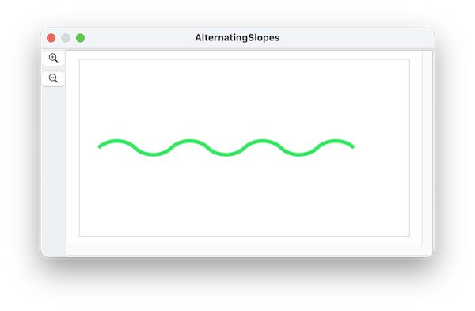

####  [Table of Contents](TableOfContents.md) 
#### previous topic: [Paths Part 1](SinterpixelsPaths.md)  next topic:  [Paths Part 3](PathDetails.md)

## Tangents and Slopes

**path** shapes are a new feature in SinterPixels 26.3.4

Each path anchor has a **tangent** property -- that's the angle at which the path passes through that anchor point.  The default units for tangent is an angle in degrees.

However, sometimes it may be more convenient to specify the tangent in terms of the slope at that point. Sinterpixels allows this in two different ways.  The simplest is to specify a floating point value for the slope traditionally the rise over the run.  Here's a wavy line defined using that method, just eight points along the x axis with slopes alternating between 1 and -1:

 

```
tell application "SinterPixels"
	set anchorData to {}
	repeat with n from -2 to 1
		set nextAnchor to {position:{n * 100, 0}, slope:1}
		set anchorData to anchorData & {nextAnchor}
		set nextAnchor to {position:{n * 100 + 50, 0}, slope:-1}
		set anchorData to anchorData & {nextAnchor}
	end repeat
	tell document 1
		set thePath to make new path with properties {closed:false, anchor data:anchorData, position:{0, 0}, line width:5, color:{0.2, (1.0 - n * 0.1), (0.2 + n * 0.1)}, fill color:clear}	
	end tell
end tell
```

Of course, a point with a vertical tangent has an infinite slope, so this can cause problems if one isn't careful.  SinterPixels deals with this in two different ways.  In one method, the constants **infinity** and **negative infinity** can be used:

 

```
tell application "SinterPixels"
	set anchorData to {}
	repeat with n from -2 to 1
		set nextAnchor to {position:{n * 100, 0}, slope:infinity}
		set anchorData to anchorData & {nextAnchor}
		set nextAnchor to {position:{n * 100 + 50, 0}, slope:negative infinity}
		set anchorData to anchorData & {nextAnchor}
	end repeat
	tell document 1
		set thePath to make new path with properties {closed:false, anchor data:anchorData, position:{0, 0}, line width:5, color:{0.2, (1.0 - n * 0.1), (0.2 + n * 0.1)}, fill color:clear}
	end tell
end tell
```

A slope can also be specified using a special record type containing a delta and a deltay value: 

 
 ```
 tell application "SinterPixels"
	set anchorData to {}
	repeat with n from -2 to 1
		set nextAnchor to {position:{n * 100, 0}, slope:{deltax:1, deltay:2}}
		set anchorData to anchorData & {nextAnchor}
		set nextAnchor to {position:{n * 100 + 50, 0}, slope:{deltax:1, deltay:-2}}
		set anchorData to anchorData & {nextAnchor}
	end repeat
	tell document 1
		set thePath to make new path with properties {closed:false, anchor data:anchorData, position:{0, 0}, line width:5, color:{0.2, (1.0 - n * 0.1), (0.2 + n * 0.1)}, fill color:clear}
	end tell
end tell
```

#### previous topic: [Paths Part 1](SinterpixelsPaths.md)  next topic:  [Paths Part 3](PathDetails.md)