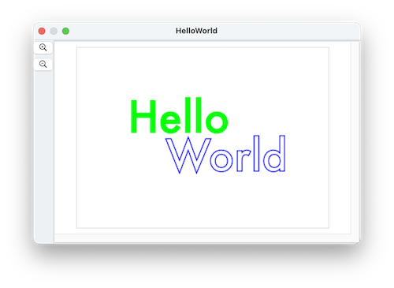

####  [Table of Contents](TableOfContents.md) 
#### previous topic: [Part 3: Irregular Vertices](SinterpixelsPolygons3.md)  next topic:  [Specifying Colors](Colors1.md) 

## Text Shapes

(Text shapes are new in version 26.2.3)

Text shapes draw text.  They have the same color, position, fill color, color and line width properties as other shapes

Like polygons, they have a rotation. 

Unique to text shapes are the **contents**, the **font**, **font size** and **size** properties.

run the following script to make a "Hello World" document

 

```
tell application "SinterPixels"
	set d to make new document with properties {height:300, width:420}
	tell d
		make new text shape with properties {position:{-40, 32}, font:"Futura", contents:"Hello", font size:72, fill color:green, line width:0}
		make new text shape with properties {position:{40, -32}, font:"Futura", contents:"World", font size:72, fill color:clear, line width:2, color:blue}
		repeat with n from 1 to 360
			set rotation of every text shape to n
		end repeat
	end tell
end tell
```
 
(size is a new property of text shapes in Sinterpixels version 26.3.1)
**size** is a read-only property. It can be useful in cases where you want to have two text shapes next to each other but not overlapping.
Here is a script that creates two text shapes and separates them by 20 pixels:

```
tell application "SinterPixels"
	set theDoc to make new document with properties {height:240, wigth:320}
	tell theDoc
		set helloShape to make new text shape with properties {contents:"Hello", fill color:blue, font size:36}
		set helloWidth to width of size of helloShape
		set position of helloShape to {-10 - helloWidth / 2, 0}
		set worldShape to make new text shape with properties {contents:"World", fill color:blue, font size:36}
		set worldWidth to width of size of worldShape
		set position of worldShape to {10 + worldWidth / 2, 0}
	end tell
end tell
``` 

Note that the script had to create the text shape first, then get the size, then reset the position of the text based on that size.


 
#### previous topic: [Part 3: Irregular Vertices](SinterpixelsPolygons3.md))  next topic:  [Specifying Colors](Colors1.md) )
