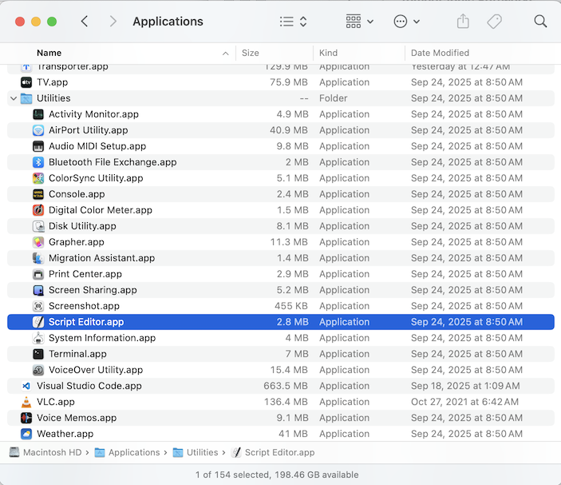
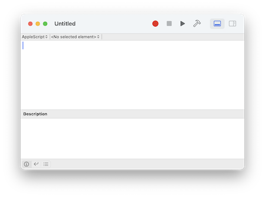
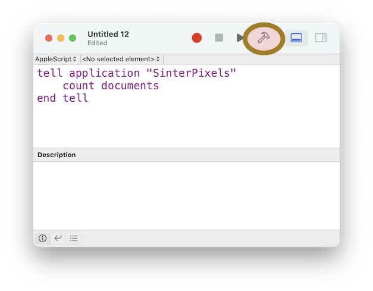
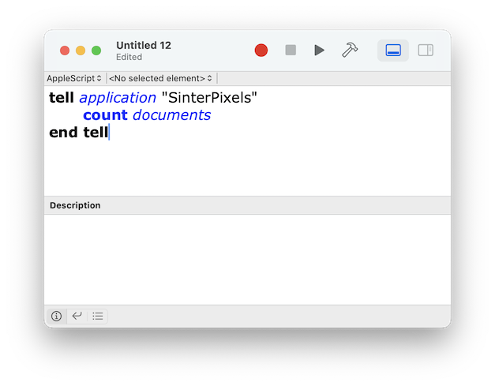
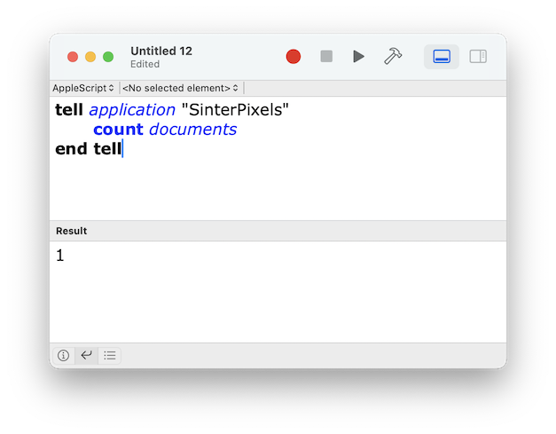

#### previous topic: [Opening a File](OpeningAFile.md)  next topic: [Shapes](SinterpixelsShapes.md)

## Using the Scripting Interface

Currently, definition of mass ranges is best done via the scripting interface.  Application of .rrng files is a feature I'm working on, but for now, scripting is the best way to accomplish this.

Before diving in to mass ranges, familiarize yourself with using the scripting interface:

First locate and open the ScriptEditor application.  It is usually located in the the Utilities folder of the Applications Folder:



If you open the Script Editor application, you should be able to create an empty script window, like this:



Let's write a very simple script.  Type the following in the script editor window:

```
tell app "Sinterpixels"
    count documents
end 
```

after typing this, click the "compile" button in the toolbar of the script editor window.  It's the one that looks like a hammer, highlighted here in red:



After clicking the button, if all has gone well, you'll notice a few things changed:

1. The text formatting has changed.
2. The word "app" in the first line changed to "application"
3. The last line changed from "end" to "end tell"



All of these are signs that Script Editor was able to successfully compile the script -- that is, it understands what should happen when the script is run.

Now it is time to run the script.

Tap the run button in the toolbar.  That's the triangle next to the "Compile" button. When the script runs, it communicates with the "Sinterpixels" application and asks it how many documents it currently has open.  "Sinterpixels" responds and the result is displayed in the bottom half of the Script Editor window.  If you've been following along and have already opened a .pos file, the answer should be 1, or more if you've opened more than one .pos file.



If you haven't yet opened a file, make a new one now, so that the script returns "1".  

Now lets try getting some information from the document.  try the following scripts:

```
tell app "Sinterpixels"
    get name of document 1
end 
```

```
tell app "Sinterpixels"
    make new circle in document 1
end 
```

```
tell app "Sinterpixels"
    count circles of document 1
end 
```

```
tell app "Sinterpixels"
    get {radius, color} of circle 2 of document 1
end 
```

If you successfully get the data you were expecting as results from these scripts, you are ready to explore shapes

#### previous topic: [Opening a File](OpeningAFile.md)  next topic: [Shapes](SinterpixelsShapes.md)
